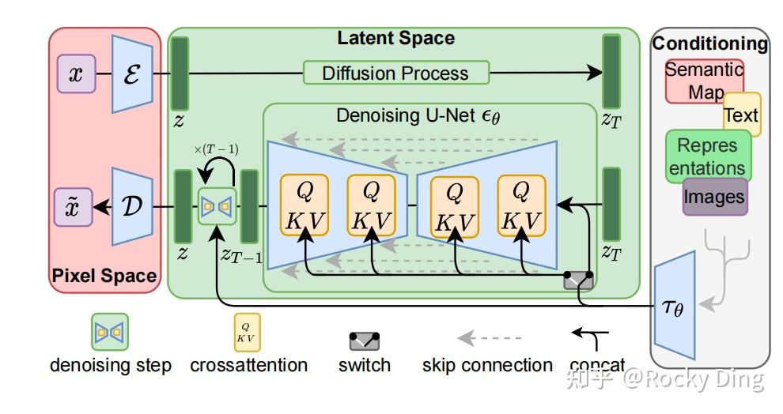
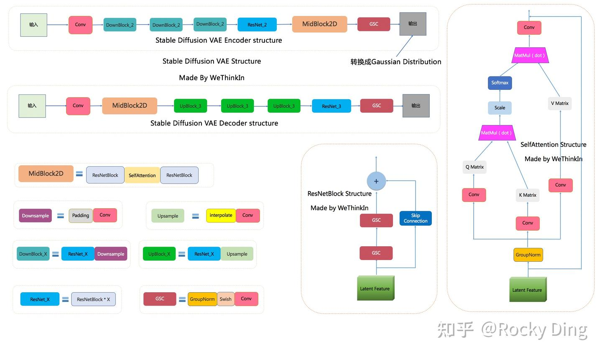
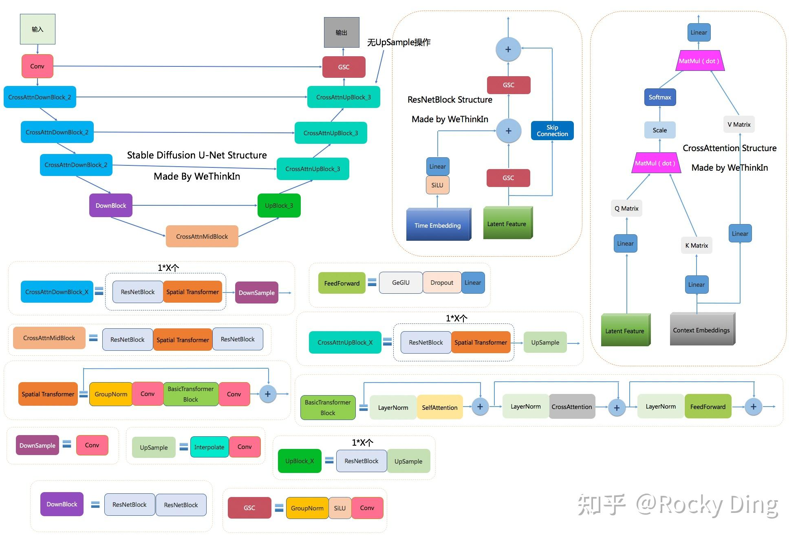
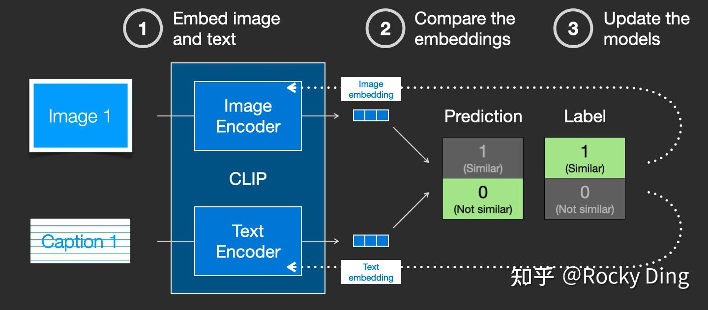
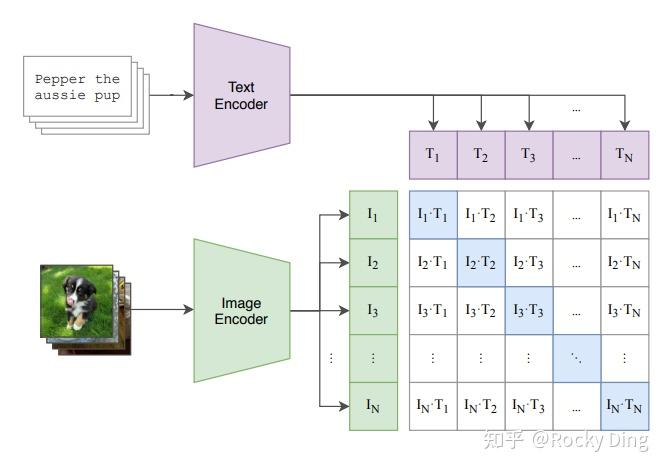
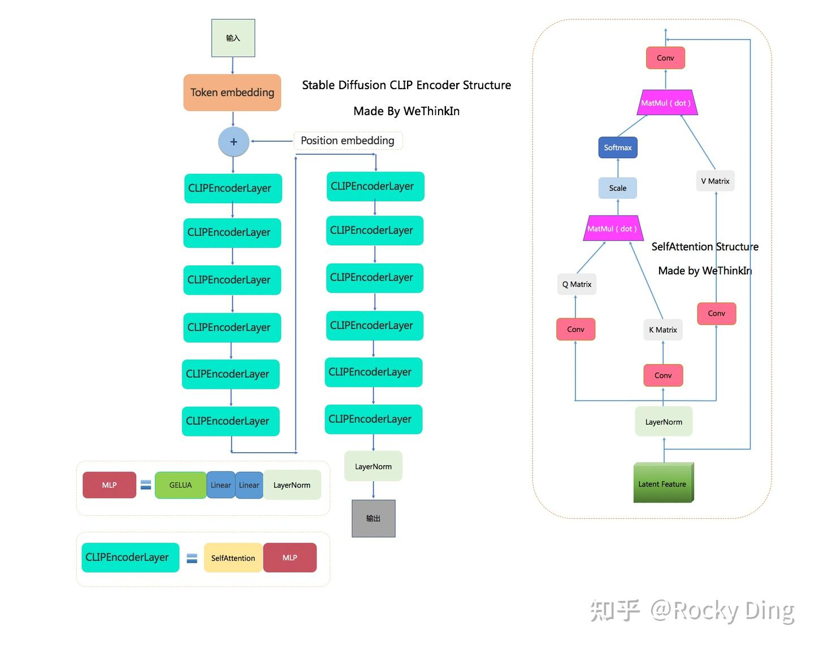
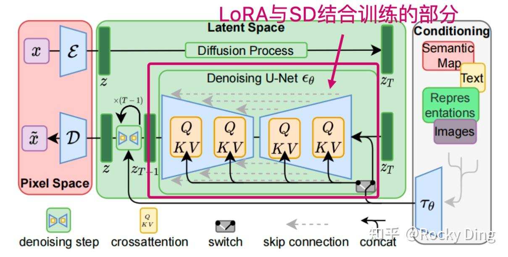
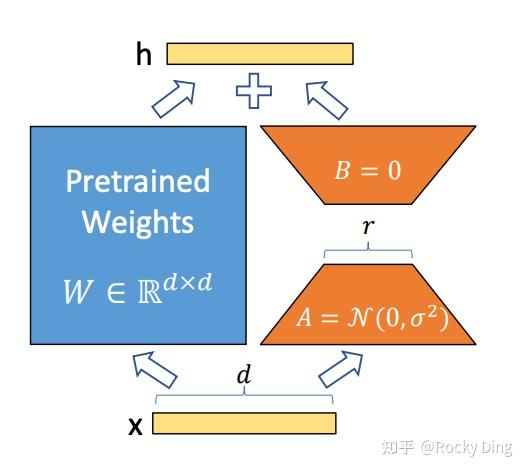

# AIGC相关知识

* CV
* GAN
* SD


# Stable-Diffusion模型

[深入浅出完整解析Stable Diffusion（SD）核心基础知识](https://zhuanlan.zhihu.com/p/632809634)

[深入浅出完整解析ControlNet核心基础知识](https://zhuanlan.zhihu.com/p/660924126)

## 整体架构

**Stable Diffusion模型整体上是一个End-to-End模型**，主要由VAE（变分自编码器，Variational Auto-Encoder），U-Net以及CLIP Text Encoder三个核心组件构成。

在FP16精度下Stable Diffusion模型大小2G（FP32：4G），其中U-Net大小1.6G，VAE模型大小160M以及CLIP Text Encoder模型大小235M（约123M参数）。其中U-Net结构包含约860M参数，以FP32精度下大小为3.4G左右。



## VAE模型

### VAE结构

在Stable Diffusion中，**VAE（变分自编码器，Variational Auto-Encoder）是基于Encoder-Decoder架构的生成模型**。VAE的Encoder（编码器）结构能将输入图像转换为低维Latent特征，并作为U-Net的输入。VAE的Decoder（解码器）结构能将低维Latent特征重建还原成像素级图像。



SD VAE模型中有三个基础组件：

1. GSC组件：GroupNorm+Swish+Conv
2. Downsample组件：Padding+Conv
3. Upsample组件：Interpolate+Conv

同时SD VAE模型还有两个核心组件：ResNetBlock模块和SelfAttention模型，两个模块的结构如上图所示。

SD VAE Encoder部分包含了三个DownBlock模块、一个ResNetBlock模块以及一个MidBlock模块，将输入图像压缩到Latent空间，转换成为Gaussian Distribution。

而VAE Decoder部分正好相反，其输入Latent空间特征，并重建成为像素级图像作为输出。其包含了三个UpBlock模块、一个ResNetBlock模块以及一个MidBlock模块。

### VAE训练过程与损失函数

在Stable Diffusion中，需要对VAE模型进行微调训练，主要采用了**L1回归损失和感知损失**（perceptual loss，Learned Perceptual Image Patch Similarity，LPIPS）作为损失函数，同时使用了**基于patch的对抗训练策略**。

**L1回归损失**作为传统深度学习时代的经典回归损失，用在回归问题中衡量预测值与真实值之间的差异，在生成模型中很常用，其公式如下所示：
$$
L_1(y,\hat{y})=\sum_{i=1}^n|y_i-\hat{y_i}|
$$
其中，yi 是输入数据的真实值，y^i 是模型生成数据的预测值，n 是数据总数。

**感知损失**同样作为传统深度学习时代的经典回归损失，在AIGC时代继续繁荣。**感知损失的核心思想是比较原始图像和生成图像在传统深度学习模型（VGG、ResNet、ViT等）不同层中特征图之间的相似度，而不直接进行像素级别的对比**。

传统深度学习模型能够提取图像的高维语义信息的特征，**如果两个图像在高维语义信息的特征上接近，那么它们在像素级别的语意上也应该是相似的**，感知损失在图像重建、风格迁移等任务中非常有效。

感知损失的公式如下所示：
$$
L_{perceptual}=\sum_{l} \lambda_l⋅||\phi_l(I_{pred})−\phi_l(I_{target})||_2^2
$$
其中：

- $\phi_l$ 表示在预训练模型（比如VGG/ResNet网络）的第l层的激活特征。
- $I_{pred}$ 是模型生成的图像。
- $I_{target}$ 是真实图像。
- $\lambda_l$ 是第 $l$ 层的权重，可以根据实际情况设置合适值

PatchGAN是GAN系列模型的一个变体，**其判别器架构不再评估整个生成图像是否真实，而是评估生成图像中的patch部分是否真实**。具体来说，PatchGAN的判别器接收一张图像，并输出一个矩阵，矩阵中的每个元素代表图像中对应区域的真实性。这种方法能够专注于优化生成图像的局部特征，生成更细腻、更富有表现力的纹理，同时计算负担相对较小。特别适合于那些细节和纹理特别重要的任务，例如图像超分辨率、风格迁移或图生图等任务。

与此同时，**为了防止在Latent空间的任意缩放导致的标准差过大**，在训练VAE模型的过程中引入了**正则化损失**，主要包括KL（Kullback-Leibler）正则化与VQ（Vector Quantization）正则化。**KL正则化**主要是让Latnet特征不要偏离正态分布太远，同时设置了较小的权重（～10e-6）来保证VAE的重建效果。**VQ正则化**通过在decoder模块中引入一个VQ-layer，将VAE转换成VQ-GAN，同样为了保证VAE的重建效果，设置较高的codebook采样维度（8192）。

Stable Diffusion论文中实验了不同参数下的VAE模型性能表现，具体如下图所示。**当f较小和c较大时，重建效果较好（PSNR值较大）**，因为此时图像的压缩率较小。但是VAE模型在ImageNet数据集上训练时发现**设置过小的f（比如1和2）会导致VAE模型收敛速度慢**，SD模型需要更长的训练周期。如果**设置过大的f会导致VAE模型的生成质量较差，因为此时压缩损失过大**。论文中实验发现，当设置f在4～16的区间时，VAE模型可以取得相对好的生成效果。

Stable Diffusion中VAE训练的完整损失函数：


$$
\begin{array}{c}
\mathcal{L}_{\text {Autoencoder }}=\min _{\mathcal{E}, \mathcal{D}} \max _{\psi} \\
\left(\mathcal{L}_{r e c}(x, \mathcal{D}(\mathcal{E}(x)))-\mathcal{L}_{u d v}(\mathcal{D}(\mathcal{E}(x)))+\log \mathcal{D}_{\psi}(x)+\mathcal{L}_{r e g}(x ; \mathcal{E}, \mathcal{D})\right)
\end{array}
$$
其中$\mathcal{E}(x)$表示VAE重建的图像，$\mathcal{L}_{r e c}$ 表示L1回归损失和感知损失，$\mathcal{L}_{u d v}+log \mathcal{D}_{\phi}$ 表示PachGAN的判别器损失， Lreg 表示KL正则损失。

虽然VAE模型使用了KL正则化，但是由于KL正则化的权重系数非常小，实际生成的Latent特征的标准差依旧存在比较大的情况，所以Stable Diffusion论文中提出了一种**rescaling方法强化正则效果**。首先我们计算第一个batch数据中Latent特征的标准差σ，然后采用1/σ的系数来rescale后续所有的Latent特征使其标准差接近于1。同时在Decoder模块进行重建时，只需要将生成的Latent特征除以1/σ，再进行像素级重建即可。**在SD中，U-Net模型使用的是经过rescaling后的Latent特征，并且将rescaling系数设置为0.18215**。


## u-net

在Stable Diffusion中，**U-Net模型是一个关键核心部分，能够预测噪声残差**，并结合Sampling method（调度算法：DDPM、DDIM、DPM++等）对输入的特征矩阵进行重构，**逐步将其从随机高斯噪声转化成图片的Latent Feature**。

具体来说，在前向推理过程中，SD模型通过反复调用 U-Net，将预测出的噪声残差从原噪声矩阵中去除，得到逐步去噪后的图像Latent Feature，再通过VAE的Decoder结构将Latent Feature重建成像素级图像。

Stable Diffusion中的U-Net，在传统深度学习时代的Encoder-Decoder结构的基础上，**增加了ResNetBlock（包含Time Embedding）模块，Spatial Transformer（SelfAttention + CrossAttention + FeedForward）模块以及CrossAttnDownBlock，CrossAttnUpBlock和CrossAttnMidBlock模块**。



**上图中包含Stable Diffusion U-Net的十四个基本模块：**

1. **GSC模块：**Stable Diffusion U-Net中的最小组件之一，由GroupNorm+SiLU+Conv三者组成。
2. **DownSample模块：**Stable Diffusion U-Net中的下采样组件，**使用了Conv（kernel_size=(3, 3), stride=(2, 2), padding=(1, 1)）进行采下采样**。
3. **UpSample模块：**Stable Diffusion U-Net中的上采样组件，由**插值算法（nearest）**+Conv组成。
4. **ResNetBlock模块：**借鉴ResNet模型的“残差结构”，**让网络能够构建的更深的同时，将Time Embedding信息嵌入模型**。
5. **CrossAttention模块：**将文本的语义信息与图像的语义信息进行Attention机制，增强输入文本Prompt对生成图片的控制。
6. **SelfAttention模块：**SelfAttention模块的整体结构与CrossAttention模块相同，这是输入全部都是图像信息，不再输入文本信息。
7. **FeedForward模块：**Attention机制中的经典模块，由GeGlU+Dropout+Linear组成。
8. **BasicTransformer Block模块：**由LayerNorm+SelfAttention+CrossAttention+FeedForward组成，是多重Attention机制的级联，并且也借鉴ResNet模型的“残差结构”。**通过加深网络和多Attention机制，大幅增强模型的学习能力与图文的匹配能力**。
9. **Spatial Transformer模块：**由GroupNorm+Conv+BasicTransformer Block+Conv构成，ResNet模型的“残差结构”依旧没有缺席。
10. **DownBlock模块：**由两个ResNetBlock模块组成。
11. **UpBlock_X模块：**由X个ResNetBlock模块和一个UpSample模块组成。
12. **CrossAttnDownBlock_X模块：**是Stable Diffusion U-Net中Encoder部分的主要模块，由X个（ResNetBlock模块+Spatial Transformer模块）+DownSample模块组成。
13. **CrossAttnUpBlock_X模块：**是Stable Diffusion U-Net中Decoder部分的主要模块，由X个（ResNetBlock模块+Spatial Transformer模块）+UpSample模块组成。
14. **CrossAttnMidBlock模块：**是Stable Diffusion U-Net中Encoder和ecoder连接的部分，由ResNetBlock+Spatial Transformer+ResNetBlock组成。

### ResNetBlock模块

在传统深度学习时代，ResNet的残差结构在图像分类，图像分割，目标检测等主流方向中几乎是不可或缺，**其简洁稳定有效的“残差思想”终于在AIGC时代跨过周期，在SD模型的U-Net结构中继续繁荣**。

值得注意的是，**Time Embedding正是输入到ResNetBlock模块中，为U-Net引入了时间信息（时间步长T，T的大小代表了噪声扰动的强度），模拟一个随时间变化不断增加不同强度噪声扰动的过程，让SD模型能够更好地理解时间相关性**。

同时，在SD模型调用U-Net重复迭代去噪的过程中，我们希望在迭代的早期，能够先生成整幅图片的轮廓与边缘特征，随着迭代的深入，再补充生成图片的高频和细节特征信息。**由于在每个ResNetBlock模块中都有Time Embedding，就能告诉U-Net现在是整个迭代过程的哪一步，并及时控制U-Net够根据不同的输入特征和迭代阶段而预测不同的噪声残差**。

**再从AI绘画应用视角解释一下Time Embedding的作用。**Time Embedding能够让SD模型在生成图片时考虑时间的影响，使得生成的图片更具有故事性、情感和沉浸感等艺术效果。并且Time Embedding可以帮助SD模型在不同的时间点将生成的图片添加完善不同情感和主题的内容，从而增加了AI绘画的多样性和表现力。

定义Time Embedding的代码如下所示，可以看到Time Embedding的生成方式，主要通过sin和cos函数再经过Linear层进行变换：

```python
def time_step_embedding(self, time_steps: torch.Tensor, max_period: int = 10000):
    half = self.channels // 2
    frequencies = torch.exp(
            -math.log(max_period) * torch.arange(start=0, end=half, dtype=torch.float32) / half
        ).to(device=time_steps.device)
    args = time_steps[:, None].float() * frequencies[None]
    return torch.cat([torch.cos(args), torch.sin(args)], dim=-1)
```

讲完Time Embedding的相关核心知识，我们再学习一下ResNetBlock模块的整体知识。

在上面的Stable Diffusion U-Net完整结构图中展示了完整的ResNetBlock模块，其输入包括Latent Feature和 Time Embedding。首先Latent Feature经过GSC（GroupNorm+SiLU激活函数+卷积）模块后和Time Embedding（经过SiLU激活函数+全连接层处理）做**加和操作**，之后再经过GSC模块和Skip Connection而来的输入Latent Feature做**加和操作**，进行**两次特征融合**后最终得到ResNetBlock模块的Latent Feature输出，**增强SD模型的特征学习能力**。

同时，和传统深度学习时代的U-Net结构一样，Decoder结构中的ResNetBlock模块不单单要接受来自上一层的Latent Feature，还要与Encoder结构中对应层的ResNetBlock模块的输出Latent Feature进行**concat操作**。举个例子，如果Decoder结构中ResNetBlock Structure上一层的输出结果的尺寸为 [512, 512, 1024]，Encoder结构对应 ResNetBlock Structure的输出结果的尺寸为 [512, 512, 2048]，那么这个Decoder结构中ResNeBlock Structure得到的Latent Feature的尺寸为 [512, 512, 3072]。

### CrossAttention模块

**CrossAttention模块是我们使用输入文本Prompt控制SD模型图片内容生成的关键一招。**

上面的Stable Diffusion U-Net完整结构图中展示了Spatial Transformer(Cross Attention)模块的结构。Spatial Transformer模块和ResNetBlock模块一样接受**两个输入**：一个是ResNetBlock模块的输出，另外一个是输入文本Prompt经过CLIP Text Encoder模型编码后的Context Embedding。

两个输入首先经过Attention机制（**将Context Embedding对应的语义信息与图片中对应的语义信息相耦合**），输出新的Latent Feature，再将新输出的Latent Feature与输入的Context Embedding再做一次Attention机制，**从而使得SD模型学习到了文本与图片之间的特征对应关系**。

**Spatial Transformer模块不改变输入输出的尺寸，只在图片对应的位置上融合了语义信息，所以不管是在传统深度学习时代，还是AIGC时代，Spatial Transformer都是将本文与图像结合的一个“万金油”模块**。

看CrossAttention模块的结构图，大家可能会疑惑**为什么Context Embedding用来生成K和V，Latent Feature用来生成Q呢？**

原因也非常简单：因为在Stable Diffusion中，主要的目的是想把文本信息注入到图像信息中里，所以用图片token对文本信息做 Attention实现逐步的文本特征提取和耦合。

**再从AI绘画应用视角解释一下CrossAttention模块的作用。**CrossAttention模块在AI绘画应用中可以被视为一种连接和表达的工具，它有助于在输入文本和生成图片之间建立联系，创造更具深度和多样性的艺术作品，引发观众的思考和情感共鸣。CrossAttention模块可以将图像和文本信息关联起来，就像艺术家可以将不同的元素融合到一幅作品中，这有助于在创作中实现不同信息之间的协同和互动，产生更具创意性的艺术作品。再者CrossAttention模块可以用于将文本中的情感元素传递到生成图片中，这种情感的交互可以增强艺术作品的表现力和观众的情感共鸣。

### BasicTransformer Block模块

BasicTransformer Block模块是在CrossAttention子模块的基础上，增加了SelfAttention子模块和Feedforward子模块共同组成的，**并且每个子模块都是一个残差结构**，这样**除了能让文本的语义信息与图像的语义信息更好的融合之外，还能通过SelfAttention机制让模型更好的学习图像数据的特征**。

**Stable Diffusion U-Net中的SelfAttention到底起了什么作用呀?**

首先，在Stable Diffusion U-Net的SelfAttention模块中，**输入只有图像信息，所以SelfAttention主要是为了让SD模型更好的学习图像数据的整体特征**。

再者，**SelfAttention可以将输入图像的不同部分（像素或图像Patch）进行交互，从而实现特征的整合和全局上下文的引入，能够让模型建立捕捉图像全局关系的能力，有助于模型理解不同位置的像素之间的依赖关系，以更好地理解图像的语义。**

在此基础上，**SelfAttention还能减少平移不变性问题**，SelfAttention模块可以在不考虑位置的情况下捕捉特征之间的关系，因此具有一定的平移不变性。

**再从AI绘画应用视角解释一下SelfAttention的作用。**SelfAttention模块可以让SD模型在图片生成过程中捕捉内在关系、创造性表达情感和思想、突出重要元素，并创造出丰富多彩、具有深度和层次感的艺术作品。

### **Spatial Transformer模块**

更进一步的，在BasicTransformer Block模块基础上，加入GroupNorm和两个卷积层就组成Spatial Transformer模块。Spatial Transformer模块是SD U-Net中的核心Base结构，Encoder中的CrossAttnDownBlock模块，Decoder中的CrossAttnUpBlock模块以及CrossAttnMidBlock模块都包含了大量的Spatial Transformer子模块。

**在生成式模型中，GroupNorm的效果一般会比BatchNorm更好**，生成式模型通常比较复杂，因此需要更稳定和适应性强的归一化方法。

而GroupNorm主要有以下一些优势，让其能够成为生成式模型的标配：

1. **对训练中不同Batch-Size的适应性**：在生成式模型中，通常需要使用不同的Batch-Size进行训练和微调。这会导致 BatchNorm在训练期间的不稳定性，而GroupNorm不受Batch-Size的影响，因此更适合生成式模型。
2. **能适应通道数变化**：GroupNorm 是一种基于通道分组的归一化方法，更适应通道数的变化，而不需要大量调整。
3. **更稳定的训练**：生成式模型的训练通常更具挑战性，存在训练不稳定性的问题。GroupNorm可以减轻训练过程中的梯度问题，有助于更稳定的收敛。
4. **能适应不同数据分布**：生成式模型通常需要处理多模态数据分布，GroupNorm 能够更好地适应不同的数据分布，因为它不像 Batch Normalization那样依赖于整个批量的统计信息。

### **CrossAttnDownBlock/CrossAttnUpBlock/CrossAttnMidBlock模块**

在Stable Diffusion U-Net的Encoder部分中，**使用了三个CrossAttnDownBlock模块，其由ResNetBlock Structure+SpatialTransformer Block+Downsample构成**。Downsample通过使用一个卷积（kernel_size=(3, 3), stride=(2, 2), padding=(1, 1)）来实现。

在Decoder部分中，**使用了三个CrossAttnUpBlock模块，其由ResNetBlock Structure+SpatialTransformer Block+Upsample构成**。Upsample使用插值算法+卷积来实现，插值算法将输入的Latent Feature尺寸扩大一倍，同时通过一个卷积（kernel_size=(3, 3), stride=(1, 1), padding=(1, 1)）改变Latent Feature的通道数，以便于输入后续的模块中。

在CrossAttnMidBlock模块中，**包含ResNetBlock Structure+SpatialTransformer Block+ResNetBlock Structure**，作为U-Net的Encoder与Decoder之间的媒介。

### **Stable Diffusion U-Net整体宏观角度小结**

**从整体上看，不管是在训练过程还是前向推理过程，Stable Diffusion中的U-Net在每次循环迭代中Content Embedding部分始终保持不变，而Time Embedding每次都会发生变化。**

和传统深度学习时代的U-Net一样，**Stable Diffusion中的U-Net也是不限制输入图片的尺寸，因为这是个基于Transformer和卷积的模型结构**。

### **Stable Diffusion中U-Net的训练过程与损失函数**

在我们进行Stable Diffusion模型训练时，VAE部分和CLIP部分都是冻结的，所以说官方在训练SD系列模型的时候，训练过程一般主要训练U-Net部分。

我们之前我们已经讲过在Stable Diffusion中U-Net主要是进行噪声残差，在SD系列模型训练时和DDPM一样采用预测噪声残差的方法来训练U-Net，其损失函数如下所示：
$$
L_{S D}=\mathbb{E}_{\mathbf{x}_{0}, \epsilon \sim \mathcal{N}(\mathbf{0}, \mathbf{I}), t}\left[\left\|\epsilon-\epsilon_{\theta}\left(\sqrt{\bar{\alpha}_{t}} \mathbf{x}_{0}+\sqrt{1-\bar{\alpha}_{t}} \epsilon, t, \mathbf{c}\right)\right\|^{2}\right]
$$
这里的c为Text Embeddings

## **CLIP Text Encoder模型**

**Stable Diffusion中的文本编码模块直接决定了语义信息的优良程度，从而影响到最后图片生成的质量和与文本的一致性。**

在这里，**多模态领域的神器——CLIP（Contrastive Language-Image Pre-training）**，跨过了周期，从传统深度学习时代进入AIGC时代，成为了SD系列模型中文本和图像之间的**“桥梁”**。**并且从某种程度上讲，正是因为CLIP模型的前置出现，加速推动了AI绘画领域的繁荣**。

首先，**CLIP模型是一个基于对比学习的多模态模型，主要包含Text Encoder和Image Encoder两个模型**。其中Text Encoder用来提取文本的特征，可以使用NLP中常用的text transformer模型作为Text Encoder；而Image Encoder主要用来提取图像的特征，可以使用CNN/Vision transformer模型（ResNet和ViT等）作为Image Encoder。**与此同时，他直接使用4亿个图片与标签文本对数据集进行训练，来学习图片与本文内容的对应关系。**

与U-Net的Encoder和Decoder一样，CLIP的Text Encoder和Image Encoder也能非常灵活的切换，庞大图片与标签文本数据的预训练赋予了CLIP强大的zero-shot分类能力。

**灵活的结构，简洁的思想，让CLIP不仅仅是个模型，也给我们一个很好的借鉴，往往伟大的产品都是大道至简的。更重要的是，CLIP把自然语言领域的抽象概念带到了计算机视觉领域。**

CLIP在训练时，从训练集中随机取出一张图片和标签文本，接着CLIP模型的任务主要是通过Text Encoder和Image Encoder分别将标签文本和图片提取**embedding向量**，然后用**余弦相似度（cosine similarity）**来比较两个embedding向量的**相似性**，以判断随机抽取的标签文本和图片是否匹配，并进行梯度反向传播，不断进行优化训练。



上面讲了Batch为1时的情况，当我们把训练的Batch提高到 N 时，其实整体的训练流程是不变的。**只是现在CLIP模型需要将N个标签文本和N个图片的两两组合预测出N2个可能的文本-图片对的余弦相似性**，即下图所示的矩阵。这里共有N个正样本，即真正匹配的文本和图片（矩阵中的对角线元素），而剩余的N2−N个文本-图片对为负样本，**这时CLIP模型的训练目标就是最大化N个正样本的余弦相似性，同时最小化N2−N个负样本的余弦相似性**。



完成CLIP的训练后，**输入配对的图片和标签文本，则Text Encoder和Image Encoder可以输出相似的embedding向量**，计算余弦相似度就可以得到接近1的结果。**同时对于不匹配的图片和标签文本，输出的embedding向量计算余弦相似度则会接近0**。

**就这样，CLIP成为了计算机视觉和自然语言处理这两大AI方向的“桥梁”，从此AI领域的多模态应用有了经典的基石模型。**

**CLIP模型主要包含Text Encoder和Image Encoder两个部分**，在Stable Diffusion中主要使用了Text Encoder部分。**CLIP Text Encoder模型将输入的文本Prompt进行编码，转换成Text Embeddings（文本的语义信息）**，通过前面章节提到的U-Net网络的**CrossAttention模块嵌入Stable Diffusion中作为Condition条件，对生成图像的内容进行一定程度上的控制与引导**，目前SD模型使用的的是[CLIP ViT-L/14](https://link.zhihu.com/?target=https%3A//huggingface.co/openai/clip-vit-large-patch14)中的Text Encoder模型。

CLIP ViT-L/14 中的Text Encoder是只包含Transformer结构的模型，一共由12个CLIPEncoderLayer模块组成，模型参数大小是123M，具体CLIP Text Encoder模型结构如下图所示。其中特征维度为768，token数量是77，**所以输出的Text Embeddings的维度为77x768**。

```shell
CLIPEncoderLayer(
    (self_attn): CLIPAttention(
        (k_proj): Linear(in_features=768, out_features=768, bias=True)
        (v_proj): Linear(in_features=768, out_features=768, bias=True)
        (q_proj): Linear(in_features=768, out_features=768, bias=True)
        (out_proj): Linear(in_features=768, out_features=768, bias=True)
      )
    (layer_norm1): LayerNorm((768,), eps=1e-05, elementwise_affine=True)
    (mlp): CLIPMLP(
        (activation_fn): QuickGELUActivation()
        (fc1): Linear(in_features=768, out_features=3072, bias=True)
            (fc2): Linear(in_features=3072, out_features=768, bias=True)
          )
          (layer_norm2): LayerNorm((768,), eps=1e-05, elementwise_affine=True)
        )
```

### **Stable Diffusion CLIP Text Encoder的完整结构图**



一般来说，我们提取CLIP Text Encoder模型最后一层特征作为CrossAttention模块的输入，**但是开源社区的不断实践为我们总结了如下经验：当我们生成二次元内容时，可以选择提取CLIP Text Encoder模型倒数第二层特征；当我们生成写实场景内容时，可以选择提取CLIP Text Encoder模型最后一层的特征。**

由于CLIP训练时所采用的最大Token数是77，所以在SD模型进行前向推理时，当输入Prompt的Token数量超过77时，将通过Clip操作拉回77x768，而如果Token数不足77则会使用padding操作得到77x768。**如果说全卷积网络的设计让图像输入尺寸不再受限，那么CLIP的这个设置就让输入的文本长度不再受限（可以是空文本）**。无论是非常长的文本，还是空文本，最后都将得到一样维度的特征矩阵。

一般来说CLIP的整体性能是足够支撑我们的下游细分任务的，所以**CLIP Text Encoder模型参数是冻结的，我们不需要对其重新训练**。

## SD官方训练过程

**SD的训练是多阶段的，**先在256x256尺寸上预训练，然后在512x512尺寸上微调训练，不同的训练方式产生了不同的版本：

- SD 1.1：先在LAION2B-en数据集上用256x256分辨率训练237,000步（LAION2B-en数据集中256分辨率以上的数据一共有1324M）；然后在LAION-5B的[高分辨率数据集](https://link.zhihu.com/?target=https%3A//huggingface.co/datasets/laion/laion-high-resolution)（laion-high-resolution：LAION-5B数据集中图像分辨率在1024x1024以上的样本，共170M样本）用512x512分辨率接着训练194,000步。
- SD 1.2：以SD 1.1为初始权重，在laion-improved-aesthetics数据集（LAION2B-en数据集中美学评分在5分以上并且分辨率大于512x512的无水印数据子集，一共约有600M个样本。这里设置了pwatermark>0.5为水印图片的规则来过滤含有水印的图片）上用512x512分辨率训练了515,000步。
- SD 1.3：以SD 1.2为初始权重，在laion-improved-aesthetics数据集上继续用512x512分辨率训练了195,000步，并且采用了CFG技术（训练时以10%的概率dropping掉Text Embeddings）进行优化。
- SD 1.4：以SD 1.2为初始权重，在laion-aesthetics v2 5+数据集上采用CFG技术用512x512分辨率训练了225,000步。
- SD 1.5：以SD 1.2为初始权重，在laion-aesthetics v2 5+数据集上采用CFG技术用512x512分辨率训练了595,000步。

根据上面官方的训练过程，我们可以看到SD 1.3、SD 1.4以及SD 1.5模型都是在SD 1.2的基础上结合CFG技术在laion-improved-aesthetics和laion-aesthetics v2 5+数据集持续训练得到的不同阶段的模型权重，**目前最热门的版本是Stable Diffusion 1.5模型**。

## SD模型测评

对于AI绘画模型，目前常用的定量指标是**FID**（Fréchet inception distance）和**CLIP score**，其中FID可以衡量生成图像的逼真度（image fidelity），而CLIP score可以测评生成图像与输入文本的一致性。其中**FID值越低越好，而CLIP score则越大越好**。

# LoRA基础知识

**LoRA（Low-Rank Adaptation）本质上是对特征矩阵进行[低秩分解](https://zhida.zhihu.com/search?content_id=230181857&content_type=Article&match_order=1&q=低秩分解&zhida_source=entity)的一种近似数值分解技术**，可以大幅降低特征矩阵的参数量，但是会伴随着一定的有损压缩。**从传统深度学习时代走来的读者，可以发现其实LoRA本质上是基于Stable Diffusion的一种轻量化技术**。

在AI绘画领域，我们可以使用SD模型+LoRA模型的组合微调训练方式，只训练参数量很小的LoRA模型，就能在一些细分任务中取得不错的效果。

**LoRA模型的训练逻辑**是首先冻结SD模型的权重，然后**在SD模型的U-Net结构中注入LoRA权重，主要作用于CrossAttention部分，并只对这部分的参数进行微调训练**。



也就是说，对于SD模型权重 $W_o \in \mathbb{R}^{n \times m}$ ，我们不再对其进行全参微调训练，我们对权重**加入残差**的形式，通过训练ΔW来完成优化过程：
$$
W'=W_o+\Delta W
$$
其中 $\Delta W = AB, A \in \mathbb{R}^{n \times d}, B \in \mathbb{N}^{d \times m}, d << n$，d**就是 ΔW 这个参数[矩阵的秩](https://zhida.zhihu.com/search?content_id=230181857&content_type=Article&match_order=1&q=矩阵的秩&zhida_source=entity)（Rank，lora_dim）**， ΔW 通过**低秩分解由两个[低秩矩阵](https://zhida.zhihu.com/search?content_id=230181857&content_type=Article&match_order=1&q=低秩矩阵&zhida_source=entity)的乘积组成**。一般来说，尽管SD模型的参数量很大，但每个**细分任务对应的本征维度（Intrinsic Dimension）**并不大，所以我们设置较小的d值就能获得一个参数量远小于SD模型的LoRA模型，并在一些细分任务中获得较好的效果。同时如果我们将d设置的越小，LoRA模型的参数量就越小，但是 |W′−AB| 的近似度就越差。

我们假设原来的ΔW是100*1024的参数矩阵，那么参数量为102400，LoRA模型将ΔW矩阵拆成了两个矩阵相乘，如果我们设置Rank=8，那么就是100*8的B矩阵与8*1024的A矩阵做[矩阵乘法](https://zhida.zhihu.com/search?content_id=230181857&content_type=Article&match_order=1&q=矩阵乘法&zhida_source=entity)，参数量为800+8192=8992，**整体参数量下降了约11.39倍。非常简洁、高效的思想！**



上图是LoRA模型训练的示意图。通常来说，**对于矩阵A，我们使用[随机高斯分布](https://zhida.zhihu.com/search?content_id=230181857&content_type=Article&match_order=1&q=随机高斯分布&zhida_source=entity)初始化，并对矩阵B使用全0初始化，使得在训练初始状态下这两个矩阵相乘的结果为0。这样能够保证在训练初始阶段时，SD模型的权重完全生效**。

虽然矩阵B使用全0初始化能够让SD模型的权重完全生效，但同时也带来了不对称问题（矩阵B全零，矩阵A非全零）。我们可以通过**“补权重”法（训练前先在SD模型权重中减去矩阵AB的权重）**来使矩阵AB都使用随机高斯分布初始化，在效果不变的情况下，增加了对称性：
$$
W' = W_o - \Delta W + \Delta W
$$
**像SD、LLM等大模型往往具有较低的内在维度，这意味着大模型的权重矩阵往往是低秩的。换句话说，并非大模型所有的参数都是必需的！**我们可以将这些权重[矩阵分解](https://zhida.zhihu.com/search?content_id=230181857&content_type=Article&match_order=1&q=矩阵分解&zhida_source=entity)为低秩矩阵，并通过训练这部分权重来实现比较好的性能，换个更通俗地表达：“不是大模型全参微调训练不起，而是LoRA模型更有性价比！


