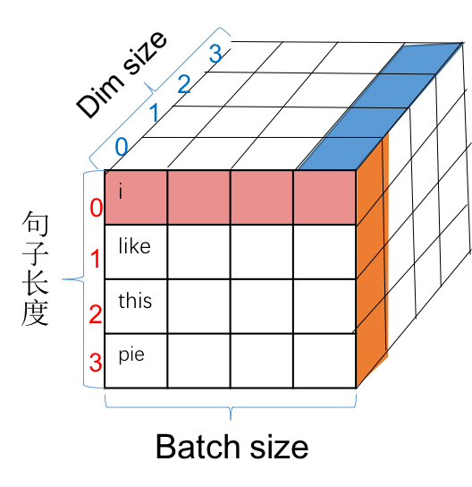

# 大模型相关知识

记录学习LLama、GPT、ChatGLM的相关笔记

主流大模型：

- [ ] LLama
- [ ] GPT3
- [ ] ChatGPT
- [ ] ChatGLM
- [ ] T5

参考资料链接：

1. [大模型基础](https://github.com/datawhalechina/so-large-lm)
2. Attention is all you need
3. [Transformer(一)--论文翻译：Attention Is All You Need 中文版](https://blog.csdn.net/nocml/article/details/103082600)
4. [GPT **Improving Language Understanding by Generative Pre-Training**. 2018. ](https://cdn.openai.com/research-covers/language-unsupervised/language_understanding_paper.pdf)
5. [GPT-2 **Language Models are Unsupervised Multitask Learners**. 2018.](https://cdn.openai.com/better-language-models/language_models_are_unsupervised_multitask_learners.pdf)
6. [GPT-3 **"Language Models are Few-Shot Learners"**. NeurIPS 2020. ](https://arxiv.org/abs/2005.14165)
7. [InstructGPT: **Training language models to follow instructions with human feedback**, Arxiv 2022](https://arxiv.org/abs/2203.02155)
8. [GPT-4 **"GPT-4 Technical Report"**. 2023. ](https://arxiv.org/abs/2303.08774)

# 分词

**分词器**将任意字符串转换为词元序列： 'the mouse ate the cheese.' $\Rightarrow [the, mouse, ate, the, cheese, .]$ 

## 基于空格分词

分词，其实从字面很好理解，就是把词分开，从而方便对于词进行单独的编码，对于英文字母来说，由于其天然的主要由单词+空格+标点符号组成，最简单的解决方案是使用`text.split(' ')`方式进行分词，这种分词方式对于英文这种按照空格，且每个分词后的单词有语义关系的文本是简单而直接的分词方式。然而，对于一些语言，如中文，句子中的单词之间没有空格，例如下文的形式。

$$\text{"我今天去了商店。"}$$

还有一些语言，比如德语，存在着长的复合词（例如`Abwasserbehandlungsanlange`）。即使在英语中，也有连字符词（例如father-in-law）和缩略词（例如don't），它们需要被正确拆分。例如，Penn Treebank将don't拆分为do和n't，这是一个在语言上基于信息的选择，但不太明显。因此，仅仅通过空格来划分单词会带来很多问题。

那么，什么样的分词才是好的呢？目前从直觉和工程实践的角度来说：

- 首先我们不希望有太多的词元（极端情况：字符或字节），否则序列会变得难以建模。
- 其次我们也不希望词元过少，否则单词之间就无法共享参数（例如，mother-in-law和father-in-law应该完全不同吗？），这对于形态丰富的语言尤其是个问题（例如，阿拉伯语、土耳其语等）。
- 每个词元应该是一个在语言或统计上有意义的单位。

## Unigram model (SentencePiece)

与仅仅根据频率进行拆分不同，一个更“有原则”的方法是定义一个目标函数来捕捉一个好的分词的特征，这种基于目标函数的分词模型可以适应更好分词场景，Unigram model就是基于这种动机提出的。我们现在描述一下unigram模型（[Kudo，2018年](https://arxiv.org/pdf/1804.10959.pdf)）。

这是SentencePiece工具（[Kudo＆Richardson，2018年](https://aclanthology.org/D18-2012.pdf)）所支持的一种分词方法，与BPE一起使用。
它被用来训练T5和Gopher模型。给定一个序列 $x_{1:L}$ ，一个分词器 $T$ 是 $p\left(x_{1: L}\right)=\prod_{(i, j) \in T} p\left(x_{i: j}\right)$ 的一个集合。这边给出一个实例：

- 训练数据（字符串）： $𝖺𝖻𝖺𝖻𝖼$
- 分词结果  $T={(1,2),(3,4),(5,5)}$ （其中 $V=\{𝖺𝖻,𝖼\}$ ）
- 似然值： $p(x_{1:L})=2/3⋅2/3⋅1/3=4/27$

在这个例子中，训练数据是字符串" $𝖺𝖻𝖺𝖻𝖼$ "。分词结果  $T={(1,2),(3,4),(5,5)}$  表示将字符串拆分成三个子序列： $(𝖺,𝖻)，(𝖺,𝖻)，(𝖼)$ 。词汇表 $V=\{𝖺𝖻,𝖼\}$ 表示了训练数据中出现的所有词汇。

似然值  $p(x_{1:L})$ 是根据 unigram 模型计算得出的概率，表示训练数据的似然度。在这个例子中，概率的计算为  $2/3⋅2/3⋅1/3=4/27$ 。这个值代表了根据 unigram 模型，将训练数据分词为所给的分词结果 $T $的概率。

unigram 模型通过统计每个词汇在训练数据中的出现次数来估计其概率。在这个例子中， $𝖺𝖻$ 在训练数据中出现了两次， $𝖼$ 出现了一次。因此，根据 unigram 模型的估计， $p(𝖺𝖻)=2/3$ ， $p(𝖼)=1/3$ 。通过将各个词汇的概率相乘，我们可以得到整个训练数据的似然值为 $4/27$ 。

似然值的计算是 unigram 模型中重要的一部分，它用于评估分词结果的质量。较高的似然值表示训练数据与分词结果之间的匹配程度较高，这意味着该分词结果较为准确或合理。

# 模型架构

## 语言模型分类

对于语言模型来说，最初的起源来自于Transformer模型，这个模型是编码-解码端 （Encoder-Decoder）的架构。但是当前对于语言模型的分类，将语言模型分为三个类型：编码端（Encoder-Only），解码端（Decoder-Only）和编码-解码端（Encoder-Decoder）

### 编码端（Encoder-Only）架构

编码端架构的著名的模型如BERT、RoBERTa等。这些语言模型生成上下文向量表征，但不能直接用于生成文本。可以表示为， $x_{1:L}⇒ϕ(x_{1:L})$ 。这些上下文向量表征通常用于分类任务（也被称为自然语言理解任务）。任务形式比较简单，下面以情感分类/自然语言推理任务举例：

$$
情感分析输入与输出形式：[[CLS], 他们, 移动, 而, 强大]\Rightarrow 正面情绪
$$

$$
自然语言处理输入与输出形式：[[CLS], 所有, 动物, 都, 喜欢, 吃, 饼干, 哦]⇒蕴涵
$$

该架构的优势是对于文本的上下文信息有更好的理解，因此该模型架构才会多用于理解任务。该架构的优点是对于每个 $x{i}$ ，上下文向量表征可以双向地依赖于左侧上下文 $(x_{1:i−1})$ 和右侧上下文  $(x_{i+1:L})$ 。但是缺点在于不能自然地生成完成文本，且需要更多的特定训练目标（如掩码语言建模）。

### 解码器（Decoder-Only）架构

解码器架构的著名模型就是大名鼎鼎的GPT系列模型。这些是我们常见的自回归语言模型，给定一个提示 
 $x_{1:i}$ ，它们可以生成上下文向量表征，并对下一个词元 $x_{i+1}$ （以及递归地，整个完成 
 $x_{i+1:L}$） 生成一个概率分布。 $x_{1:i}⇒ϕ(x_{1:i}),p(x_{i+1}∣x_{1:i})$ 。我们以自动补全任务来说，输入与输出的形式为， $[[CLS], 他们, 移动, 而]⇒强大$ 。与编码端架构比，其优点为能够自然地生成完成文本，有简单的训练目标（最大似然）。缺点也很明显，对于每个  $xi$ ，上下文向量表征只能单向地依赖于左侧上下文  ($x_{1:i−1}$) 。

###  编码-解码端（Encoder-Decoder）架构

编码-解码端架构就是最初的Transformer模型，其他的还有如BART、T5等模型。这些模型在某种程度上结合了两者的优点：它们可以使用双向上下文向量表征来处理输入 $x_{1:L}$ ，并且可以生成输出 $y_{1:L}$ 。可以公式化为：

$$
x1:L⇒ϕ(x1:L),p(y1:L∣ϕ(x1:L))。
$$

以表格到文本生成任务为例，其输入和输出的可以表示为：

$$
[名称:, 植物, |, 类型:, 花卉, 商店]⇒[花卉, 是, 一, 个, 商店]。
$$

该模型的具有编码端，解码端两个架构的共同的优点，对于每个 $x_{i}$ ，上下文向量表征可以双向地依赖于左侧上下文  $x_{1:i−1}$ ) 和右侧上下文 ( $x_{i+1:L}$ )，可以自由的生成文本数据。缺点就说需要更多的特定训练目标。

# Transformer结构

[Attention Is All You Need](https://arxiv.org/abs/1706.03762)


## 编码和解码结构

**编码器**：编码器由6个相同的层组合而成，每一层有两个子层：第一层是多头自注意机制，第二层是一个简单的前馈神经网络。这两个子层都添加了一个残差神经网络和LayerNorm，所以这两个子层的输出为 $LayerNorm(x + Sublayer(x))$，其中 $Sublayer(x)$ 是子层的实现。

**解码器**：解码器同样也是6个相同的层组成。解码器包含两个多头注意机制和一个前馈神经网络，每一个子层同样包含残差连接和LayerNorm。第一个多头注意力层采用了掩码操作，保证对i输入的预测只依赖于小于i的输入。第二个多头注意力层的k、v矩阵使用编码器的输出结果，Q来自于解码器的第一个多头注意力层。

## Attention


注意力函数可以描述为将查询（query）和一组键值映射到输出，Query（Q）、Key（K）和 Value（V）都是向量。

三个向量是通过Embed Token和三个权重矩阵 $W^Q, W^k, W^v$ 相乘得到，$ d_k$ 表示key向量的维度，最终的Attention的计算如下：
$$
Attention(Q, K, V) = softmax(\frac{QK^T}{\sqrt{d_k}})V
$$

> $d_k$ 越大的话，点乘的乘积会比较大，将点乘的乘积乘以 $\frac{1}{\sqrt{d_k}}$可以减少数值范围，让softmax函数的梯度更平滑

```python
def attention(query, key, value, mask=None):
    d_k = query.size(-1)
    scores = torch.matmul(query, key.transpose(-2, -1)) \
             / math.sqrt(d_k)
    if mask is not None:
        scores = scores.masked_fill(mask == 0, -1e9)
    p_attn = F.softmax(scores, dim = -1)
    return torch.matmul(p_attn, value)
```

在softmax之前的mask操作是用一个很小的值对制定位置进行覆盖填充，这样在之后计算softmax时，由于填充的值很小，所以计算出来的概率也会很小，基本就忽略了。

**LayerNormalization模块**

不论是layer normalization还是batch normalization，其实做的都是一件事情，都是根据 $x = a*\frac{x-\overline{x}}{std+eps} + b $ 对 x 的分布进行调整。不同的是 $\overline{x}$ 和 $std$ 的计算方式不同



batch normalization的 $\overline{x}$ 和 std 是延粉色方向计算的，而layer normalization是延蓝色方向计算的。如果兄弟们去面试，可能面试官会问为什么这里没有使用BN，而使用了LN,我的理解是，BN对batch size的大小是有要求的，一般batch size越大，计算出的 $\overline{x}$  越好，而我用12G内存的GPU，跑transformer的模型时，batch size最多也就设置到32。batch size还是偏小的。所以使用与batch size无关的layer normlization。从另一个角度讲，==batch size之所以小，是因为我们的embedding size 大，而layer normalization 正好是延这个方向做的，所以正好使得layer normalization计算的更稳定==。

## Multi-Head Attention

利用学习到的不同的线性映射将Q, K, V映射到 $d_q, d_k, d_v$ 维度 h 次，在不同的映射 Q, K, V 向量，并行的执行 Attention 函数，Concat之后再做一个线性映射，得到最终的值。

Multi-head attention允许模型把不同位置子序列的表示都整合到一个信息中。如果只有一个attention head，它的平均值会削弱这个信息。
$$
\begin{aligned}
\operatorname{MultiHead}(Q, K, V) & =\operatorname{Concat}\left(\operatorname{head}_{1}, \ldots, \text { head }_{\mathrm{h}}\right) W^{O} \\
\text { where head } & =\operatorname{Attention}\left(Q W_{i}^{Q}, K W_{i}^{K}, V W_{i}^{V}\right)
\end{aligned}
$$

> 前面我们说过了，Q、K、V三个矩阵是encoder的输入经过三个linear映射而成，它们的大小是[ B , L , D ] [B,L,D][B,L,D](batch size, max sentence length, embedding size), 这里为了说的清楚些，我们暂时不看B这个维度。那么Q、K、V的维度都为[ L , D ][L,D]，multi-head就是在[ D ]维度上对数据进行切割，把数据切成等长的8段（h = 8），这样Q、K、V均被切成等长的8段，然后对应的Q、K、V子段组成一组，每组通过 Scaled Dot-Product Attention 算法计算出结果，这样的结果我们会得到8个，然后把这8个结果再拼成一个结果，就multi-head的结果。具体过程如下图：
> 

## Applications of Attention in our Model

multi-head attention在Transformer中有三种不同的使用方式：

- 在encoder-decoder attention层中，queries来自前面的decoder层，而keys和values来自encoder的输出。这使得decoder中的每个位置都能关注到输入序列中的所有位置。 这是模仿序列到序列模型中典型的编码器—解码器的attention机制，例如。
- encoder包含self-attention层。 在self-attention层中，所有的key、value和query来自同一个地方，在这里是encoder中前一层的输出。 encoder中的每个位置都可以关注到encoder上一层的所有位置。
- 类似地，decoder中的self-attention层允许decoder中的每个位置都关注decoder层中当前位置之前的所有位置（包括当前位置）。==为了保持解码器的自回归特性，需要防止解码器中的信息向左流动。我们在scaled dot-product attention的内部 ，通过屏蔽softmax输入中所有的非法连接值（设置为 −∞）实现了这一点==。

## Position-wise Feed-Forward Networks

除了Attention子层外，Encoder和Decoder还包含一个全链接的前馈网络，分别作用每一个位置，其包含两个线性变换，中间包含一个ReLU激活函数
$$
FFN(x) = \max(0, xW_1+b_1)W_2+b_2
$$
线性变换的形式在不同的位置相同，但是不同的层之前使用的不同的参数。

## Embedding and Softmax

与其他序列转换模型类似，我们使用学习到的嵌入词向量 将输入字符和输出字符转换为维度为 $d_{model}$ 的向量。我们还使用普通的线性变换和softmax函数将decoder输出转换为预测的下一个词符的概率。两个嵌入层之间和pre-softmax线性变换共享相同的权重矩阵。 在嵌入层中，我们将这些权重乘以 $\sqrt{d_{model}}$

## Positional Encoding

由于我们的模型不包含循环或卷积，为了让模型利用序列的顺序信息，我们必须加入序列中关于字符相对或者绝对位置的一些信息。 为此，我们在encoder和decoder堆栈底部的输入嵌入中添加“位置编码”。 位置编码和嵌入的维度 $d_{model}$ 相同，所以它们两个可以相加。有多种位置编码可以选择，例如通过学习得到的位置编码和固定的位置编码

使用不同频率的正弦和余弦函数：
$$
\begin{aligned}
P E_{(p o s, 2 i)} & =\sin \left(p o s / 10000^{2 i / d_{\mathrm{model}}}\right) \\
P E_{(p o s, 2 i+1)} & =\cos \left(p o s / 10000^{2 i / d_{\mathrm{model}}}\right)
\end{aligned}
$$
其中pos 是位置，i 是维度。也就是说，位置编码的每个维度对应于一个正弦曲线。波长形成了从2π到10000·2π的几何数列。我们之所以选择这个函数，是因为我们假设它可以让模型很容易地通过相对位置来学习,因为对任意确定的偏移 $k,PE_{pos+k}$ 可以表示为 $PE_{pos}$  的线性函数。

>  每个位置（pos）的PE值均不同，因此我们可以根据PE的值区分位置，**而由上面的线性函数，我们可以计量出两个位置的相对距离**。

# GPT

[GPT **Improving Language Understanding by Generative Pre-Training**. 2018. ](https://cdn.openai.com/research-covers/language-unsupervised/language_understanding_paper.pdf) 是OpenAI研究团队发布的一篇论文。


# BERT


# GPT2


# GPT-3


# LLaMA模型


