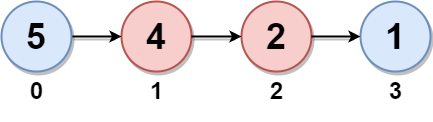
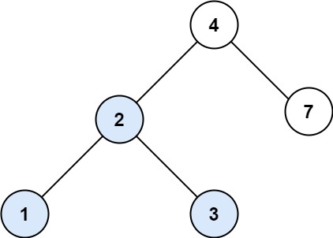

## [3. 无重复字符的最长子串](https://leetcode.cn/problems/longest-substring-without-repeating-characters/)

中等


相关标签

相关企业


提示


给定一个字符串 `s` ，请你找出其中不含有重复字符的 **最长** 

**子串**

 的长度。


 

**示例 1:**

```
输入: s = "abcabcbb"
输出: 3 
解释: 因为无重复字符的最长子串是 "abc"，所以其长度为 3。
```

**示例 2:**

```
输入: s = "bbbbb"
输出: 1
解释: 因为无重复字符的最长子串是 "b"，所以其长度为 1。
```

**示例 3:**

```
输入: s = "pwwkew"
输出: 3
解释: 因为无重复字符的最长子串是 "wke"，所以其长度为 3。
     请注意，你的答案必须是 子串 的长度，"pwke" 是一个子序列，不是子串。
```

 

**提示：**

- `0 <= s.length <= 5 * 104`
- `s` 由英文字母、数字、符号和空格组成

题解

转换为双指针问题，相当于求解两个重复字符最大的距离

```c++
class Solution {
public:
    int lengthOfLongestSubstring(string s) {
        unordered_set<char> repeated;
        int n = s.size();
        int r = -1, ans = 0;
        for (int l = 0; l < n; l++) {
            if (l != 0) {
                repeated.erase(s[l-1]);
            }
            while(r + 1 < n && !repeated.count(s[r + 1])) {
                repeated.insert(s[r+1]);
                ++r;
            }
            ans = max(ans, r - l + 1);
        }
        return ans;
    }
}; 
```

## [146. LRU 缓存](https://leetcode.cn/problems/lru-cache/)

中等


相关标签

相关企业


请你设计并实现一个满足 [LRU (最近最少使用) 缓存](https://baike.baidu.com/item/LRU) 约束的数据结构。

实现 `LRUCache` 类：

- `LRUCache(int capacity)` 以 **正整数** 作为容量 `capacity` 初始化 LRU 缓存
- `int get(int key)` 如果关键字 `key` 存在于缓存中，则返回关键字的值，否则返回 `-1` 。
- `void put(int key, int value)` 如果关键字 `key` 已经存在，则变更其数据值 `value` ；如果不存在，则向缓存中插入该组 `key-value` 。如果插入操作导致关键字数量超过 `capacity` ，则应该 **逐出** 最久未使用的关键字。

函数 `get` 和 `put` 必须以 `O(1)` 的平均时间复杂度运行。

 

**示例：**

```
输入
["LRUCache", "put", "put", "get", "put", "get", "put", "get", "get", "get"]
[[2], [1, 1], [2, 2], [1], [3, 3], [2], [4, 4], [1], [3], [4]]
输出
[null, null, null, 1, null, -1, null, -1, 3, 4]

解释
LRUCache lRUCache = new LRUCache(2);
lRUCache.put(1, 1); // 缓存是 {1=1}
lRUCache.put(2, 2); // 缓存是 {1=1, 2=2}
lRUCache.get(1);    // 返回 1
lRUCache.put(3, 3); // 该操作会使得关键字 2 作废，缓存是 {1=1, 3=3}
lRUCache.get(2);    // 返回 -1 (未找到)
lRUCache.put(4, 4); // 该操作会使得关键字 1 作废，缓存是 {4=4, 3=3}
lRUCache.get(1);    // 返回 -1 (未找到)
lRUCache.get(3);    // 返回 3
lRUCache.get(4);    // 返回 4
```

 

**提示：**

- `1 <= capacity <= 3000`
- `0 <= key <= 10000`
- `0 <= value <= 105`
- 最多调用 `2 * 105` 次 `get` 和 `put`

**题解**

```c++
struct DLinkedNode {
    int key, value;
    DLinkedNode* prev;
    DLinkedNode* next;
    DLinkedNode(): key(0), value(0), prev(nullptr), next(nullptr){}
    DLinkedNode(int _key, int _value): key(_key), value(_value), prev(nullptr), next(nullptr) {}
};

class LRUCache {
private:
    unordered_map<int, DLinkedNode*> key_map;
    DLinkedNode* head;
    DLinkedNode* tail;
    int size;
    int capacity;

public:
    LRUCache(int _capacity): capacity(_capacity), size(0){
        head = new DLinkedNode();
        tail = new DLinkedNode();
        head->next = tail;
        tail->prev = head;
    }

    void addToHead(DLinkedNode* node) {
        node->prev = head;
        node->next = head->next;
        head->next->prev = node;
        head->next = node;
    }

    void removeNode(DLinkedNode* node) {
        node->prev->next = node->next;
        node->next->prev = node->prev;
    }

    void moveToHead(DLinkedNode* node) {
        removeNode(node);
        addToHead(node);
    }

    DLinkedNode* removeTail() {
        DLinkedNode* node = tail->prev;
        removeNode(node);
        return node;
    }
    
    int get(int key) {
        if (!key_map.count(key)) {
            return -1;
        }
        
        // 存在key，返回对应value，并将当前node移动到链表头
        DLinkedNode* node = key_map[key];
        moveToHead(node);
        return node->value;
    }
    
    void put(int key, int value) {
        if (!key_map.count(key)){
            DLinkedNode* node = new DLinkedNode(key, value);
            key_map[key] = node;
            addToHead(node);
            ++size;
            if (size > capacity){
                DLinkedNode* removed = removeTail();
                key_map.erase(removed->key);
                delete removed;
                --size;
            }

        } else {
            DLinkedNode* node = key_map[key];
            node->value = value;
            moveToHead(node);
        }
    }

    
};

/**
 * Your LRUCache object will be instantiated and called as such:
 * LRUCache* obj = new LRUCache(capacity);
 * int param_1 = obj->get(key);
 * obj->put(key,value);
 */
```


# 数组/字符串

## [1768. 交替合并字符串](https://leetcode.cn/problems/merge-strings-alternately/)

已解答

简单


相关标签

相关企业


提示


给你两个字符串 `word1` 和 `word2` 。请你从 `word1` 开始，通过交替添加字母来合并字符串。如果一个字符串比另一个字符串长，就将多出来的字母追加到合并后字符串的末尾。

返回 **合并后的字符串** 。

 

**示例 1：**

```
输入：word1 = "abc", word2 = "pqr"
输出："apbqcr"
解释：字符串合并情况如下所示：
word1：  a   b   c
word2：    p   q   r
合并后：  a p b q c r
```

**示例 2：**

```
输入：word1 = "ab", word2 = "pqrs"
输出："apbqrs"
解释：注意，word2 比 word1 长，"rs" 需要追加到合并后字符串的末尾。
word1：  a   b 
word2：    p   q   r   s
合并后：  a p b q   r   s
```

**示例 3：**

```
输入：word1 = "abcd", word2 = "pq"
输出："apbqcd"
解释：注意，word1 比 word2 长，"cd" 需要追加到合并后字符串的末尾。
word1：  a   b   c   d
word2：    p   q 
合并后：  a p b q c   d
```

 

**提示：**

- `1 <= word1.length, word2.length <= 100`
- `word1` 和 `word2` 由小写英文字母组成

**题解**

```c++
class Solution {
public:
    string mergeAlternately(string word1, string word2) {
        int m = word1.size(), n = word2.size();
        int i = 0, j = 0;
        
        string ans;
        ans.reserve(m + n);
        while(i < m || j < n) {
            if (i < m) {
                ans.push_back(word1[i]);
                ++i;
            }

            if (j < n) {
                ans.push_back(word2[j]);
                ++j;
            }
        }

        return ans;
    }
};
```

**题解**

```c++
class Solution {
public:
    string gcdOfStrings(string str1, string str2) {
        if (str1 + str2 != str2 + str1) return "";
        return str1.substr(0, gcd(str1.length(), str2.length()));
    }
};
```

## [1431. 拥有最多糖果的孩子](https://leetcode.cn/problems/kids-with-the-greatest-number-of-candies/)

简单


相关标签

相关企业


提示


有 `n` 个有糖果的孩子。给你一个数组 `candies`，其中 `candies[i]` 代表第 `i` 个孩子拥有的糖果数目，和一个整数 `extraCandies` 表示你所有的额外糖果的数量。

返回一个长度为 `n` 的布尔数组 `result`，如果把所有的 `extraCandies` 给第 `i` 个孩子之后，他会拥有所有孩子中 **最多** 的糖果，那么 `result[i]` 为 `true`，否则为 `false`。

注意，允许有多个孩子同时拥有 **最多** 的糖果数目。

 

**示例 1：**

```
输入：candies = [2,3,5,1,3], extraCandies = 3
输出：[true,true,true,false,true] 
解释：如果你把额外的糖果全部给：
孩子 1，将有 2 + 3 = 5 个糖果，是孩子中最多的。
孩子 2，将有 3 + 3 = 6 个糖果，是孩子中最多的。
孩子 3，将有 5 + 3 = 8 个糖果，是孩子中最多的。
孩子 4，将有 1 + 3 = 4 个糖果，不是孩子中最多的。
孩子 5，将有 3 + 3 = 6 个糖果，是孩子中最多的。
```

**示例 2：**

```
输入：candies = [4,2,1,1,2], extraCandies = 1
输出：[true,false,false,false,false] 
解释：只有 1 个额外糖果，所以不管额外糖果给谁，只有孩子 1 可以成为拥有糖果最多的孩子。
```

**示例 3：**

```
输入：candies = [12,1,12], extraCandies = 10
输出：[true,false,true]
```

 

**提示：**

- `n == candies.length`
- `2 <= n <= 100`
- `1 <= candies[i] <= 100`
- `1 <= extraCandies <= 50`

**题解**

```c++
class Solution {
public:
    vector<bool> kidsWithCandies(vector<int>& candies, int extraCandies) {
        int maxCandy = *max_element(candies.begin(), candies.end());
        int len = candies.size();
        vector<bool> res;
        for (int i = 0; i < len; i++) {
            if (candies[i] >= maxCandy - extraCandies) {
                res.push_back(true);
            } else {
                res.push_back(false);
            }
        }
        return res;
    }
};
```

## [605. 种花问题](https://leetcode.cn/problems/can-place-flowers/)

简单


相关标签

相关企业


假设有一个很长的花坛，一部分地块种植了花，另一部分却没有。可是，花不能种植在相邻的地块上，它们会争夺水源，两者都会死去。

给你一个整数数组 `flowerbed` 表示花坛，由若干 `0` 和 `1` 组成，其中 `0` 表示没种植花，`1` 表示种植了花。另有一个数 `n` ，能否在不打破种植规则的情况下种入 `n` 朵花？能则返回 `true` ，不能则返回 `false` 。

 

**示例 1：**

```
输入：flowerbed = [1,0,0,0,1], n = 1
输出：true
```

**示例 2：**

```
输入：flowerbed = [1,0,0,0,1], n = 2
输出：false
```

 

**提示：**

- `1 <= flowerbed.length <= 2 * 104`
- `flowerbed[i]` 为 `0` 或 `1`
- `flowerbed` 中不存在相邻的两朵花
- `0 <= n <= flowerbed.length`

**题解**

```c++
class Solution {
public:
    bool canPlaceFlowers(vector<int>& flowerbed, int n) {
        int len = flowerbed.size(), res = 0;
        if (len == 1 and flowerbed[0] == 0) return 1>=n; 
        if (len >= 2) {
            if (flowerbed[0] == 0 && flowerbed[1] == 0) {
                flowerbed[0] = 1;
                ++res;
            }

            if (flowerbed[len-2] == 0 && flowerbed[len - 1] == 0) {
                flowerbed[len-1] = 1;
                ++res;
            }
        } 
        for (int i = 1; i < len - 1; i++) {
            if (flowerbed[i-1] == 0 && flowerbed[i] == 0 && flowerbed[i + 1] == 0) {
                flowerbed[i] = 1;
                ++res;
            }
        }
        return res >= n;
    }
};
```

## [345. 反转字符串中的元音字母](https://leetcode.cn/problems/reverse-vowels-of-a-string/)

简单


相关标签

相关企业


给你一个字符串 `s` ，仅反转字符串中的所有元音字母，并返回结果字符串。

元音字母包括 `'a'`、`'e'`、`'i'`、`'o'`、`'u'`，且可能以大小写两种形式出现不止一次。

 

**示例 1：**

**输入：**s = "IceCreAm"

**输出：**"AceCreIm"

**解释：**

`s` 中的元音是 `['I', 'e', 'e', 'A']`。反转这些元音，`s` 变为 `"AceCreIm"`.

**示例 2：**

**输入：**s = "leetcode"

**输出：**"leotcede"

 

**提示：**

- `1 <= s.length <= 3 * 105`
- `s` 由 **可打印的 ASCII** 字符组成

**题解**

```c++
class Solution {
public:
    string reverseVowels(string s) {
        auto isVowel = [vowels = "aeiouAEIOU"s](char ch) {
            return vowels.find(ch) != string::npos;
        };

        int left = 0, right = s.size() - 1;
        while(left < right) {
            while(left < right && !isVowel(s[left])) {
                ++left;
            }
            while(left < right && !isVowel(s[right])) {
                --right;
            }
            if (left < right) {
                swap(s[left], s[right]);
                ++left;
                --right;
            }
            
        }
        return s;
    }
};
```

## [151. 反转字符串中的单词](https://leetcode.cn/problems/reverse-words-in-a-string/)

中等


相关标签

相关企业


给你一个字符串 `s` ，请你反转字符串中 **单词** 的顺序。

**单词** 是由非空格字符组成的字符串。`s` 中使用至少一个空格将字符串中的 **单词** 分隔开。

返回 **单词** 顺序颠倒且 **单词** 之间用单个空格连接的结果字符串。

**注意：**输入字符串 `s`中可能会存在前导空格、尾随空格或者单词间的多个空格。返回的结果字符串中，单词间应当仅用单个空格分隔，且不包含任何额外的空格。

 

**示例 1：**

```
输入：s = "the sky is blue"
输出："blue is sky the"
```

**示例 2：**

```
输入：s = "  hello world  "
输出："world hello"
解释：反转后的字符串中不能存在前导空格和尾随空格。
```

**示例 3：**

```
输入：s = "a good   example"
输出："example good a"
解释：如果两个单词间有多余的空格，反转后的字符串需要将单词间的空格减少到仅有一个。
```

 

**提示：**

- `1 <= s.length <= 104`
- `s` 包含英文大小写字母、数字和空格 `' '`
- `s` 中 **至少存在一个** 单词

 

**进阶：**如果字符串在你使用的编程语言中是一种可变数据类型，请尝试使用 `O(1)` 额外空间复杂度的 **原地** 解法。

**题解**

```python
class Solution:
    def reverseWords(self, s: str) -> str:
        s = s.strip()
        i = j = len(s) - 1
        res = []
        while i >= 0:
            while i >= 0 and s[i] != ' ': i -= 1
            res.append(s[i+1:j+1])
            while i >= 0 and s[i] == ' ': i -= 1
            j = i
        return ' '.join(res)
```

## [238. 除自身以外数组的乘积](https://leetcode.cn/problems/product-of-array-except-self/)

中等


相关标签

相关企业


提示


给你一个整数数组 `nums`，返回 数组 `answer` ，其中 `answer[i]` 等于 `nums` 中除 `nums[i]` 之外其余各元素的乘积 。

题目数据 **保证** 数组 `nums`之中任意元素的全部前缀元素和后缀的乘积都在 **32 位** 整数范围内。

请 **不要使用除法，**且在 `O(n)` 时间复杂度内完成此题。

 

**示例 1:**

```
输入: nums = [1,2,3,4]
输出: [24,12,8,6]
```

**示例 2:**

```
输入: nums = [-1,1,0,-3,3]
输出: [0,0,9,0,0]
```

 

**提示：**

- `2 <= nums.length <= 105`
- `-30 <= nums[i] <= 30`
- **保证** 数组 `nums`之中任意元素的全部前缀元素和后缀的乘积都在 **32 位** 整数范围内

 

**进阶：**你可以在 `O(1)` 的额外空间复杂度内完成这个题目吗？（ 出于对空间复杂度分析的目的，输出数组 **不被视为** 额外空间。）

**题解**

```python
class Solution:
    def productExceptSelf(self, nums: List[int]) -> List[int]:
        N = len(nums)
        prev, back = [1 for i in range(N+1)], [1 for i in range(N+1)]
        for i in range(N):
            prev[i+1] = prev[i] * nums[i]
            back[N-i-1] = back[N-i] * nums[N-i-1]
        res = [prev[i] * back[i+1] for i in range(N)]
        return res
```

## [334. 递增的三元子序列](https://leetcode.cn/problems/increasing-triplet-subsequence/)

中等


相关标签

相关企业


给你一个整数数组 `nums` ，判断这个数组中是否存在长度为 `3` 的递增子序列。

如果存在这样的三元组下标 `(i, j, k)` 且满足 `i < j < k` ，使得 `nums[i] < nums[j] < nums[k]` ，返回 `true` ；否则，返回 `false` 。

 

**示例 1：**

```
输入：nums = [1,2,3,4,5]
输出：true
解释：任何 i < j < k 的三元组都满足题意
```

**示例 2：**

```
输入：nums = [5,4,3,2,1]
输出：false
解释：不存在满足题意的三元组
```

**示例 3：**

```
输入：nums = [2,1,5,0,4,6]
输出：true
解释：三元组 (3, 4, 5) 满足题意，因为 nums[3] == 0 < nums[4] == 4 < nums[5] == 6
```

 

**提示：**

- `1 <= nums.length <= 5 * 105`
- `-231 <= nums[i] <= 231 - 1`

 

**进阶：**你能实现时间复杂度为 `O(n)` ，空间复杂度为 `O(1)` 的解决方案吗？

**题解**

```python
class Solution:
    def increasingTriplet(self, nums: List[int]) -> bool:
        N = len(nums)
        if N < 3:
            return False
        first, second = nums[0], float('inf')
        i = 0
        for i in range(1, N):
            num = nums[i]
            if num > second:
                return True
            if num > first:
                second = num
            else:
                first = num
        return False
```

## [443. 压缩字符串](https://leetcode.cn/problems/string-compression/)

中等


相关标签

相关企业


提示


给你一个字符数组 `chars` ，请使用下述算法压缩：

从一个空字符串 `s` 开始。对于 `chars` 中的每组 **连续重复字符** ：

- 如果这一组长度为 `1` ，则将字符追加到 `s` 中。
- 否则，需要向 `s` 追加字符，后跟这一组的长度。

压缩后得到的字符串 `s` **不应该直接返回** ，需要转储到字符数组 `chars` 中。需要注意的是，如果组长度为 `10` 或 `10` 以上，则在 `chars` 数组中会被拆分为多个字符。

请在 **修改完输入数组后** ，返回该数组的新长度。

你必须设计并实现一个只使用常量额外空间的算法来解决此问题。

 

**示例 1：**

```
输入：chars = ["a","a","b","b","c","c","c"]
输出：返回 6 ，输入数组的前 6 个字符应该是：["a","2","b","2","c","3"]
解释："aa" 被 "a2" 替代。"bb" 被 "b2" 替代。"ccc" 被 "c3" 替代。
```

**示例 2：**

```
输入：chars = ["a"]
输出：返回 1 ，输入数组的前 1 个字符应该是：["a"]
解释：唯一的组是“a”，它保持未压缩，因为它是一个字符。
```

**示例 3：**

```
输入：chars = ["a","b","b","b","b","b","b","b","b","b","b","b","b"]
输出：返回 4 ，输入数组的前 4 个字符应该是：["a","b","1","2"]。
解释：由于字符 "a" 不重复，所以不会被压缩。"bbbbbbbbbbbb" 被 “b12” 替代。
```

 

**提示：**

- `1 <= chars.length <= 2000`
- `chars[i]` 可以是小写英文字母、大写英文字母、数字或符号

**题解**

```python
class Solution:
    def compress(self, chars: List[str]) -> int:
        N = len(chars)
        if N <= 1:
            return N
        prevCnt = 1
        left = 0
        for i in range(N):
            if i == N - 1 or chars[i] != chars[i+1]:
                chars[left] = chars[i]
                left += 1
                if prevCnt > 1:
                    for ch in str(prevCnt):
                        chars[left] = ch
                        left += 1
                prevCnt = 1
            else:
                prevCnt += 1
        return left
```


# 双指针

## [283. 移动零](https://leetcode.cn/problems/move-zeroes/)

简单


相关标签

相关企业


提示


给定一个数组 `nums`，编写一个函数将所有 `0` 移动到数组的末尾，同时保持非零元素的相对顺序。

**请注意** ，必须在不复制数组的情况下原地对数组进行操作。

 

**示例 1:**

```
输入: nums = [0,1,0,3,12]
输出: [1,3,12,0,0]
```

**示例 2:**

```
输入: nums = [0]
输出: [0]
```

 

**提示**:

- `1 <= nums.length <= 104`
- `-231 <= nums[i] <= 231 - 1`

 

**进阶：**你能尽量减少完成的操作次数吗？

**题解**

```python
class Solution:
    def moveZeroes(self, nums: List[int]) -> None:
        """
        Do not return anything, modify nums in-place instead.
        """
        N = len(nums)
        z_ptr = 0
        for i in range(N):
            if nums[i] != 0:
                nums[z_ptr] = nums[i]
                z_ptr += 1
        for j in range(z_ptr, N):
            nums[j] = 0
            
```

## [392. 判断子序列](https://leetcode.cn/problems/is-subsequence/)

简单


相关标签

相关企业


给定字符串 **s** 和 **t** ，判断 **s** 是否为 **t** 的子序列。

字符串的一个子序列是原始字符串删除一些（也可以不删除）字符而不改变剩余字符相对位置形成的新字符串。（例如，`"ace"`是`"abcde"`的一个子序列，而`"aec"`不是）。

**进阶：**

如果有大量输入的 S，称作 S1, S2, ... , Sk 其中 k >= 10亿，你需要依次检查它们是否为 T 的子序列。在这种情况下，你会怎样改变代码？

**致谢：**

特别感谢 [@pbrother ](https://leetcode.com/pbrother/)添加此问题并且创建所有测试用例。

 

**示例 1：**

```
输入：s = "abc", t = "ahbgdc"
输出：true
```

**示例 2：**

```
输入：s = "axc", t = "ahbgdc"
输出：false
```

 

**提示：**

- `0 <= s.length <= 100`
- `0 <= t.length <= 10^4`
- 两个字符串都只由小写字符组成。

**题解**

```python
class Solution:
    def isSubsequence(self, s: str, t: str) -> bool:
        N1, N2 = len(s), len(t)
        if N1 == 0:
            return True
        i, j = 0, 0
        while i < N1 and j < N2:
            if s[i] == t[j]:
                i += 1
                j += 1
            else:
                j += 1
            if i == N1:
                return True
        return False
```


## [11. 盛最多水的容器](https://leetcode.cn/problems/container-with-most-water/)

中等


相关标签

相关企业


提示


给定一个长度为 `n` 的整数数组 `height` 。有 `n` 条垂线，第 `i` 条线的两个端点是 `(i, 0)` 和 `(i, height[i])` 。

找出其中的两条线，使得它们与 `x` 轴共同构成的容器可以容纳最多的水。

返回容器可以储存的最大水量。

**说明：**你不能倾斜容器。

 

**示例 1：**


```
输入：[1,8,6,2,5,4,8,3,7]
输出：49 
解释：图中垂直线代表输入数组 [1,8,6,2,5,4,8,3,7]。在此情况下，容器能够容纳水（表示为蓝色部分）的最大值为 49。
```

**示例 2：**

```
输入：height = [1,1]
输出：1
```

 

**提示：**

- `n == height.length`
- `2 <= n <= 105`
- `0 <= height[i] <= 104`

**题解**

双指针分别指向开头和结尾，每次移动高度最低的指针，直到相遇

```python
class Solution:

    def getArea(self, height: List[int], left: int, right: int) -> int:
        return min(height[left], height[right]) * (right - left)
    
    def maxArea(self, height: List[int]) -> int:
        N = len(height)
        left, right = 0, N-1
        res = self.getArea(height, left, right)
        while left < right:
            if height[left] < height[right]:
                left += 1
                res = max(self.getArea(height, left, right), res)
            else:
                right -= 1
                res = max(self.getArea(height, left, right), res)
        return res
```


## [1679. K 和数对的最大数目](https://leetcode.cn/problems/max-number-of-k-sum-pairs/)

中等


相关标签

相关企业


提示


给你一个整数数组 `nums` 和一个整数 `k` 。

每一步操作中，你需要从数组中选出和为 `k` 的两个整数，并将它们移出数组。

返回你可以对数组执行的最大操作数。

 

**示例 1：**

```
输入：nums = [1,2,3,4], k = 5
输出：2
解释：开始时 nums = [1,2,3,4]：
- 移出 1 和 4 ，之后 nums = [2,3]
- 移出 2 和 3 ，之后 nums = []
不再有和为 5 的数对，因此最多执行 2 次操作。
```

**示例 2：**

```
输入：nums = [3,1,3,4,3], k = 6
输出：1
解释：开始时 nums = [3,1,3,4,3]：
- 移出前两个 3 ，之后nums = [1,4,3]
不再有和为 6 的数对，因此最多执行 1 次操作。
```

 

**提示：**

- `1 <= nums.length <= 105`
- `1 <= nums[i] <= 109`
- `1 <= k <= 109`

**题解**

先对数组进行排序，然后双指针分别指向0， N-1

```python
class Solution:
    def maxOperations(self, nums: List[int], k: int) -> int:
        list.sort(nums)
        N = len(nums)
        left, right = 0, N - 1
        res = 0
        while left < right:
            if nums[left] + nums[right] > k:
                right -= 1
            elif nums[left] + nums[right] < k:
                left += 1
            else:
                res += 1
                left += 1
                right -= 1
        return res

```

# 滑动窗口

## [643. 子数组最大平均数 I](https://leetcode.cn/problems/maximum-average-subarray-i/)

简单


相关标签

相关企业


给你一个由 `n` 个元素组成的整数数组 `nums` 和一个整数 `k` 。

请你找出平均数最大且 **长度为 `k`** 的连续子数组，并输出该最大平均数。

任何误差小于 `10-5` 的答案都将被视为正确答案。

 

**示例 1：**

```
输入：nums = [1,12,-5,-6,50,3], k = 4
输出：12.75
解释：最大平均数 (12-5-6+50)/4 = 51/4 = 12.75
```

**示例 2：**

```
输入：nums = [5], k = 1
输出：5.00000
```

 

**提示：**

- `n == nums.length`
- `1 <= k <= n <= 105`
- `-104 <= nums[i] <= 104`

**题解**

```python
class Solution:
    def findMaxAverage(self, nums: List[int], k: int) -> float:
        res = sum(nums[:k])
        temp = res
        for i in range(k, len(nums)):
            temp += nums[i]
            temp -= nums[i-k]
            res = max(res, temp)
        return res / k
```


## [1456. 定长子串中元音的最大数目](https://leetcode.cn/problems/maximum-number-of-vowels-in-a-substring-of-given-length/)

中等


相关标签

相关企业


提示


给你字符串 `s` 和整数 `k` 。

请返回字符串 `s` 中长度为 `k` 的单个子字符串中可能包含的最大元音字母数。

英文中的 **元音字母** 为（`a`, `e`, `i`, `o`, `u`）。

 

**示例 1：**

```
输入：s = "abciiidef", k = 3
输出：3
解释：子字符串 "iii" 包含 3 个元音字母。
```

**示例 2：**

```
输入：s = "aeiou", k = 2
输出：2
解释：任意长度为 2 的子字符串都包含 2 个元音字母。
```

**示例 3：**

```
输入：s = "leetcode", k = 3
输出：2
解释："lee"、"eet" 和 "ode" 都包含 2 个元音字母。
```

**示例 4：**

```
输入：s = "rhythms", k = 4
输出：0
解释：字符串 s 中不含任何元音字母。
```

**示例 5：**

```
输入：s = "tryhard", k = 4
输出：1
```

 

**提示：**

- `1 <= s.length <= 10^5`
- `s` 由小写英文字母组成
- `1 <= k <= s.length`

**题解**

```python
class Solution:

    def isVowels(self, s: str) -> bool:
        return s in "aeiou"

    def maxVowels(self, s: str, k: int) -> int:
        N = len(s)
        vowels = [1 if self.isVowels(s[i]) else 0 for i in range(N)]
        res = sum(vowels[:k])
        temp = res
        for i in range(k, N):
            temp += vowels[i]
            temp -= vowels[i-k]
            res = max(res, temp)
        return res
```


## [1004. 最大连续1的个数 III](https://leetcode.cn/problems/max-consecutive-ones-iii/)

中等


相关标签

相关企业


提示


给定一个二进制数组 `nums` 和一个整数 `k`，如果可以翻转最多 `k` 个 `0` ，则返回 *数组中连续 `1` 的最大个数* 。

 

**示例 1：**

```
输入：nums = [1,1,1,0,0,0,1,1,1,1,0], K = 2
输出：6
解释：[1,1,1,0,0,1,1,1,1,1,1]
粗体数字从 0 翻转到 1，最长的子数组长度为 6。
```

**示例 2：**

```
输入：nums = [0,0,1,1,0,0,1,1,1,0,1,1,0,0,0,1,1,1,1], K = 3
输出：10
解释：[0,0,1,1,1,1,1,1,1,1,1,1,0,0,0,1,1,1,1]
粗体数字从 0 翻转到 1，最长的子数组长度为 10。
```

 

**提示：**

- `1 <= nums.length <= 105`
- `nums[i]` 不是 `0` 就是 `1`
- `0 <= k <= nums.length`


**题解**

转化为滑动窗口内最多有k个0的子区间长度为多大，有两个变量维护左右区间0的前缀和

```python
class Solution:
    def longestOnes(self, nums: List[int], k: int) -> int:
        lsum, rsum = 0, 0
        ans = 0
        N = len(nums)
        left = 0
        for right in range(N):
            rsum += 1 - nums[right]
            while rsum - lsum > k:
                lsum += 1 - nums[left]
                left += 1
            ans = max(ans, right - left + 1)
        return ans
```


## [1493. 删掉一个元素以后全为 1 的最长子数组](https://leetcode.cn/problems/longest-subarray-of-1s-after-deleting-one-element/)

中等


相关标签

相关企业


提示


给你一个二进制数组 `nums` ，你需要从中删掉一个元素。

请你在删掉元素的结果数组中，返回最长的且只包含 1 的非空子数组的长度。

如果不存在这样的子数组，请返回 0 。

 

**提示 1：**

```
输入：nums = [1,1,0,1]
输出：3
解释：删掉位置 2 的数后，[1,1,1] 包含 3 个 1 。
```

**示例 2：**

```
输入：nums = [0,1,1,1,0,1,1,0,1]
输出：5
解释：删掉位置 4 的数字后，[0,1,1,1,1,1,0,1] 的最长全 1 子数组为 [1,1,1,1,1] 。
```

**示例 3：**

```
输入：nums = [1,1,1]
输出：2
解释：你必须要删除一个元素。
```

 

**提示：**

- `1 <= nums.length <= 105`
- `nums[i]` 要么是 `0` 要么是 `1` 。


**题解**

```python
class Solution:
    def longestSubarray(self, nums: List[int]) -> int:
        N = len(nums)
        if sum(nums) == N:
            return N - 1
        lsum, rsum = 0, 0
        left, ans = 0, 0
        for right in range(N):
            rsum += 1 - nums[right]
            while rsum - lsum > 1:
                lsum += 1 - nums[left]
                left += 1
            ans = max(ans, right - left + 1 - rsum + lsum)
        return ans
```

# 前缀和

## [1732. 找到最高海拔](https://leetcode.cn/problems/find-the-highest-altitude/)

简单


相关标签

相关企业


提示


有一个自行车手打算进行一场公路骑行，这条路线总共由 `n + 1` 个不同海拔的点组成。自行车手从海拔为 `0` 的点 `0` 开始骑行。

给你一个长度为 `n` 的整数数组 `gain` ，其中 `gain[i]` 是点 `i` 和点 `i + 1` 的 **净海拔高度差**（`0 <= i < n`）。请你返回 **最高点的海拔** 。

 

**示例 1：**

```
输入：gain = [-5,1,5,0,-7]
输出：1
解释：海拔高度依次为 [0,-5,-4,1,1,-6] 。最高海拔为 1 。
```

**示例 2：**

```
输入：gain = [-4,-3,-2,-1,4,3,2]
输出：0
解释：海拔高度依次为 [0,-4,-7,-9,-10,-6,-3,-1] 。最高海拔为 0 。
```

 

**提示：**

- `n == gain.length`
- `1 <= n <= 100`
- `-100 <= gain[i] <= 100`

**题解**

```python
class Solution:
    def largestAltitude(self, gain: List[int]) -> int:
        ans, alti = 0, 0
        for n in gain:
            alti += n
            ans = max(ans, alti)
        return ans
```


## [724. 寻找数组的中心下标](https://leetcode.cn/problems/find-pivot-index/)

简单


相关标签

相关企业


提示


给你一个整数数组 `nums` ，请计算数组的 **中心下标** 。

数组 **中心下标** 是数组的一个下标，其左侧所有元素相加的和等于右侧所有元素相加的和。

如果中心下标位于数组最左端，那么左侧数之和视为 `0` ，因为在下标的左侧不存在元素。这一点对于中心下标位于数组最右端同样适用。

如果数组有多个中心下标，应该返回 **最靠近左边** 的那一个。如果数组不存在中心下标，返回 `-1` 。

 

**示例 1：**

```
输入：nums = [1, 7, 3, 6, 5, 6]
输出：3
解释：
中心下标是 3 。
左侧数之和 sum = nums[0] + nums[1] + nums[2] = 1 + 7 + 3 = 11 ，
右侧数之和 sum = nums[4] + nums[5] = 5 + 6 = 11 ，二者相等。
```

**示例 2：**

```
输入：nums = [1, 2, 3]
输出：-1
解释：
数组中不存在满足此条件的中心下标。
```

**示例 3：**

```
输入：nums = [2, 1, -1]
输出：0
解释：
中心下标是 0 。
左侧数之和 sum = 0 ，（下标 0 左侧不存在元素），
右侧数之和 sum = nums[1] + nums[2] = 1 + -1 = 0 。
```

 

**提示：**

- `1 <= nums.length <= 104`
- `-1000 <= nums[i] <= 1000`

 

**注意：**本题与主站 1991 题相同：https://leetcode-cn.com/problems/find-the-middle-index-in-array/


**题解**

```python
class Solution:
    def pivotIndex(self, nums: List[int]) -> int:
        N = len(nums)
        lsum, rsum = [0 for i in range(N+1)], [0 for i in range(N+1)]
        for i in range(N):
            lsum[i+1] += lsum[i] + nums[i]
            rsum[N-i-1] = rsum[N-i] + nums[N-i-1]

        for i in range(N):
            if lsum[i] == rsum[i+1]:
                return i
        return -1
```

# 哈希表

## [2215. 找出两数组的不同](https://leetcode.cn/problems/find-the-difference-of-two-arrays/)

简单


相关标签

相关企业


提示


给你两个下标从 `0` 开始的整数数组 `nums1` 和 `nums2` ，请你返回一个长度为 `2` 的列表 `answer` ，其中：

- `answer[0]` 是 `nums1` 中所有 **不** 存在于 `nums2` 中的 **不同** 整数组成的列表。
- `answer[1]` 是 `nums2` 中所有 **不** 存在于 `nums1` 中的 **不同** 整数组成的列表。

**注意：**列表中的整数可以按 **任意** 顺序返回。

 

**示例 1：**

```
输入：nums1 = [1,2,3], nums2 = [2,4,6]
输出：[[1,3],[4,6]]
解释：
对于 nums1 ，nums1[1] = 2 出现在 nums2 中下标 0 处，然而 nums1[0] = 1 和 nums1[2] = 3 没有出现在 nums2 中。因此，answer[0] = [1,3]。
对于 nums2 ，nums2[0] = 2 出现在 nums1 中下标 1 处，然而 nums2[1] = 4 和 nums2[2] = 6 没有出现在 nums2 中。因此，answer[1] = [4,6]。
```

**示例 2：**

```
输入：nums1 = [1,2,3,3], nums2 = [1,1,2,2]
输出：[[3],[]]
解释：
对于 nums1 ，nums1[2] 和 nums1[3] 没有出现在 nums2 中。由于 nums1[2] == nums1[3] ，二者的值只需要在 answer[0] 中出现一次，故 answer[0] = [3]。
nums2 中的每个整数都在 nums1 中出现，因此，answer[1] = [] 。 
```

 

**提示：**

- `1 <= nums1.length, nums2.length <= 1000`
- `-1000 <= nums1[i], nums2[i] <= 1000`

**题解**

```python
class Solution:
    def findDifference(self, nums1: List[int], nums2: List[int]) -> List[List[int]]:
        ans = [[], []]

        set1, set2 = set(nums1), set(nums2)
        for num in set2:
            if num not in set1:
                ans[1].append(num)

        for num in set1:
            if num not in set2:
                ans[0].append(num)

        return ans
```

[1207. 独一无二的出现次数](https://leetcode.cn/problems/unique-number-of-occurrences/)

简单


相关标签

相关企业


提示


给你一个整数数组 `arr`，如果每个数的出现次数都是独一无二的，就返回 `true`；否则返回 `false`。

 

**示例 1：**

```
输入：arr = [1,2,2,1,1,3]
输出：true
解释：在该数组中，1 出现了 3 次，2 出现了 2 次，3 只出现了 1 次。没有两个数的出现次数相同。
```

**示例 2：**

```
输入：arr = [1,2]
输出：false
```

**示例 3：**

```
输入：arr = [-3,0,1,-3,1,1,1,-3,10,0]
输出：true
```

 

**提示：**

- `1 <= arr.length <= 1000`
- `-1000 <= arr[i] <= 1000`

## [1207. 独一无二的出现次数](https://leetcode.cn/problems/unique-number-of-occurrences/)

简单


相关标签

相关企业


提示


给你一个整数数组 `arr`，如果每个数的出现次数都是独一无二的，就返回 `true`；否则返回 `false`。

 

**示例 1：**

```
输入：arr = [1,2,2,1,1,3]
输出：true
解释：在该数组中，1 出现了 3 次，2 出现了 2 次，3 只出现了 1 次。没有两个数的出现次数相同。
```

**示例 2：**

```
输入：arr = [1,2]
输出：false
```

**示例 3：**

```
输入：arr = [-3,0,1,-3,1,1,1,-3,10,0]
输出：true
```

 

**提示：**

- `1 <= arr.length <= 1000`
- `-1000 <= arr[i] <= 1000`

**题解**

```python
class Solution:
    def uniqueOccurrences(self, arr: List[int]) -> bool:
        cntMap = dict()
        for a in arr:
            if a in cntMap:
                cntMap[a] += 1
            else:
                cntMap[a] = 1
        
        freqMap = set()
        for _, v in cntMap.items():
            if v in freqMap:
                return False
            else:
                freqMap.add(v)
        return True
```

## [1657. 确定两个字符串是否接近](https://leetcode.cn/problems/determine-if-two-strings-are-close/)

中等


相关标签

相关企业


提示


如果可以使用以下操作从一个字符串得到另一个字符串，则认为两个字符串 **接近** ：

- 操作 1：交换任意两个

   

  现有

   

  字符。

  - 例如，`abcde -> aecdb`

- 操作 2：将一个

   

  现有

   

  字符的每次出现转换为另一个

   

  现有

   

  字符，并对另一个字符执行相同的操作。

  - 例如，`aacabb -> bbcbaa`（所有 `a` 转化为 `b` ，而所有的 `b` 转换为 `a` ）

你可以根据需要对任意一个字符串多次使用这两种操作。

给你两个字符串，`word1` 和 `word2` 。如果 `word1` 和 `word2` **接近** ，就返回 `true` ；否则，返回 `false` 。

 

**示例 1：**

```
输入：word1 = "abc", word2 = "bca"
输出：true
解释：2 次操作从 word1 获得 word2 。
执行操作 1："abc" -> "acb"
执行操作 1："acb" -> "bca"
```

**示例 2：**

```
输入：word1 = "a", word2 = "aa"
输出：false
解释：不管执行多少次操作，都无法从 word1 得到 word2 ，反之亦然。
```

**示例 3：**

```
输入：word1 = "cabbba", word2 = "abbccc"
输出：true
解释：3 次操作从 word1 获得 word2 。
执行操作 1："cabbba" -> "caabbb"
执行操作 2："caabbb" -> "baaccc"
执行操作 2："baaccc" -> "abbccc"
```

**提示：**

- `1 <= word1.length, word2.length <= 105`
- `word1` 和 `word2` 仅包含小写英文字母


**题解**

```python
class Solution:
    def closeStrings(self, word1: str, word2: str) -> bool:
        return set(word1) == set(word2) and Counter(Counter(word1).values()) == Counter(Counter(word2).values())
```

## [2352. 相等行列对](https://leetcode.cn/problems/equal-row-and-column-pairs/)

中等


相关标签

相关企业


提示


给你一个下标从 **0** 开始、大小为 `n x n` 的整数矩阵 `grid` ，返回满足 `Ri` 行和 `Cj` 列相等的行列对 `(Ri, Cj)` 的数目*。*

如果行和列以相同的顺序包含相同的元素（即相等的数组），则认为二者是相等的。

 

**示例 1：**


```
输入：grid = [[3,2,1],[1,7,6],[2,7,7]]
输出：1
解释：存在一对相等行列对：
- (第 2 行，第 1 列)：[2,7,7]
```

**示例 2：**


```
输入：grid = [[3,1,2,2],[1,4,4,5],[2,4,2,2],[2,4,2,2]]
输出：3
解释：存在三对相等行列对：
- (第 0 行，第 0 列)：[3,1,2,2]
- (第 2 行, 第 2 列)：[2,4,2,2]
- (第 3 行, 第 2 列)：[2,4,2,2]
```

 

**提示：**

- `n == grid.length == grid[i].length`
- `1 <= n <= 200`
- `1 <= grid[i][j] <= 105`


**题解**

```python
class Solution:
    def equalPairs(self, grid: List[List[int]]) -> int:
        rowCnt = Counter(tuple(row) for row in grid)
        return sum(rowCnt[col] for col in zip(*grid))
```

# 栈

## [2390. 从字符串中移除星号](https://leetcode.cn/problems/removing-stars-from-a-string/)

中等


相关标签

相关企业


提示


给你一个包含若干星号 `*` 的字符串 `s` 。

在一步操作中，你可以：

- 选中 `s` 中的一个星号。
- 移除星号 **左侧** 最近的那个 **非星号** 字符，并移除该星号自身。

返回移除 **所有** 星号之后的字符串**。**

**注意：**

- 生成的输入保证总是可以执行题面中描述的操作。
- 可以证明结果字符串是唯一的。

 

**示例 1：**

```
输入：s = "leet**cod*e"
输出："lecoe"
解释：从左到右执行移除操作：
- 距离第 1 个星号最近的字符是 "leet**cod*e" 中的 't' ，s 变为 "lee*cod*e" 。
- 距离第 2 个星号最近的字符是 "lee*cod*e" 中的 'e' ，s 变为 "lecod*e" 。
- 距离第 3 个星号最近的字符是 "lecod*e" 中的 'd' ，s 变为 "lecoe" 。
不存在其他星号，返回 "lecoe" 。
```

**示例 2：**

```
输入：s = "erase*****"
输出：""
解释：整个字符串都会被移除，所以返回空字符串。
```

 

**提示：**

- `1 <= s.length <= 105`
- `s` 由小写英文字母和星号 `*` 组成
- `s` 可以执行上述操作

**题解**

```python
class Solution:
    def removeStars(self, s: str) -> str:
        ans = []
        for ch in s:
            if ch != '*':
                ans.append(ch)
            else:
                ans.pop()
        return ''.join(ans)
```

## [735. 小行星碰撞](https://leetcode.cn/problems/asteroid-collision/)

中等


相关标签

相关企业


提示


给定一个整数数组 `asteroids`，表示在同一行的小行星。

对于数组中的每一个元素，其绝对值表示小行星的大小，正负表示小行星的移动方向（正表示向右移动，负表示向左移动）。每一颗小行星以相同的速度移动。

找出碰撞后剩下的所有小行星。碰撞规则：两个小行星相互碰撞，较小的小行星会爆炸。如果两颗小行星大小相同，则两颗小行星都会爆炸。两颗移动方向相同的小行星，永远不会发生碰撞。

 

**示例 1：**

```
输入：asteroids = [5,10,-5]
输出：[5,10]
解释：10 和 -5 碰撞后只剩下 10 。 5 和 10 永远不会发生碰撞。
```

**示例 2：**

```
输入：asteroids = [8,-8]
输出：[]
解释：8 和 -8 碰撞后，两者都发生爆炸。
```

**示例 3：**

```
输入：asteroids = [10,2,-5]
输出：[10]
解释：2 和 -5 发生碰撞后剩下 -5 。10 和 -5 发生碰撞后剩下 10 。
```

 

**提示：**

- `2 <= asteroids.length <= 104`
- `-1000 <= asteroids[i] <= 1000`
- `asteroids[i] != 0`

**题解**

```python
class Solution:

    def collide(self, aster1: int, aster2: int) -> bool:
        if aster1 > 0 and aster2 < 0:
            return True
        return False

    def asteroidCollision(self, asteroids: List[int]) -> List[int]:
        res = []
        for aster in asteroids:
            alive = True
            while len(res) > 0 and self.collide(res[-1], aster):
                if abs(res[-1]) < abs(aster):
                    res.pop()
                elif abs(res[-1]) == abs(aster):
                    res.pop()
                    alive = False
                    break
                else:
                    alive = False
                    break
            if alive:
                res.append(aster)
        return res
```

## [394. 字符串解码](https://leetcode.cn/problems/decode-string/)

中等


相关标签

相关企业


给定一个经过编码的字符串，返回它解码后的字符串。

编码规则为: `k[encoded_string]`，表示其中方括号内部的 `encoded_string` 正好重复 `k` 次。注意 `k` 保证为正整数。

你可以认为输入字符串总是有效的；输入字符串中没有额外的空格，且输入的方括号总是符合格式要求的。

此外，你可以认为原始数据不包含数字，所有的数字只表示重复的次数 `k` ，例如不会出现像 `3a` 或 `2[4]` 的输入。

 

**示例 1：**

```
输入：s = "3[a]2[bc]"
输出："aaabcbc"
```

**示例 2：**

```
输入：s = "3[a2[c]]"
输出："accaccacc"
```

**示例 3：**

```
输入：s = "2[abc]3[cd]ef"
输出："abcabccdcdcdef"
```

**示例 4：**

```
输入：s = "abc3[cd]xyz"
输出："abccdcdcdxyz"
```

 

**提示：**

- `1 <= s.length <= 30`
- `s` 由小写英文字母、数字和方括号 `'[]'` 组成
- `s` 保证是一个 **有效** 的输入。
- `s` 中所有整数的取值范围为 `[1, 300]` 

**题解**

```python
class Solution:
    def decodeString(self, s: str) -> str:
        stack, res, multi = [], "", 0
        for c in s:
            if c == '[':
                stack.append([multi, res])
                res, multi = "", 0
            elif c == ']':
                cur_multi, last_res = stack.pop()
                res = last_res + cur_multi * res
            elif '0' <= c and c <= '9':
                multi = multi * 10 + int(c)
            else:
                res += c
        return res
    
```

# 队列

## [933. 最近的请求次数](https://leetcode.cn/problems/number-of-recent-calls/)

简单


相关标签

相关企业


写一个 `RecentCounter` 类来计算特定时间范围内最近的请求。

请你实现 `RecentCounter` 类：

- `RecentCounter()` 初始化计数器，请求数为 0 。
- `int ping(int t)` 在时间 `t` 添加一个新请求，其中 `t` 表示以毫秒为单位的某个时间，并返回过去 `3000` 毫秒内发生的所有请求数（包括新请求）。确切地说，返回在 `[t-3000, t]` 内发生的请求数。

**保证** 每次对 `ping` 的调用都使用比之前更大的 `t` 值。

 

**示例 1：**

```
输入：
["RecentCounter", "ping", "ping", "ping", "ping"]
[[], [1], [100], [3001], [3002]]
输出：
[null, 1, 2, 3, 3]

解释：
RecentCounter recentCounter = new RecentCounter();
recentCounter.ping(1);     // requests = [1]，范围是 [-2999,1]，返回 1
recentCounter.ping(100);   // requests = [1, 100]，范围是 [-2900,100]，返回 2
recentCounter.ping(3001);  // requests = [1, 100, 3001]，范围是 [1,3001]，返回 3
recentCounter.ping(3002);  // requests = [1, 100, 3001, 3002]，范围是 [2,3002]，返回 3
```

 

**提示：**

- `1 <= t <= 109`
- 保证每次对 `ping` 调用所使用的 `t` 值都 **严格递增**
- 至多调用 `ping` 方法 `104` 次

**题解**

```python
class RecentCounter:

    def __init__(self):
        self.q = deque()

    def ping(self, t: int) -> int:
        self.q.append(t)
        while self.q[0] < t - 3000:
            self.q.popleft()
        return len(self.q)


# Your RecentCounter object will be instantiated and called as such:
# obj = RecentCounter()
# param_1 = obj.ping(t)
```

## [649. Dota2 参议院](https://leetcode.cn/problems/dota2-senate/)

中等


相关标签

相关企业


Dota2 的世界里有两个阵营：`Radiant`（天辉）和 `Dire`（夜魇）

Dota2 参议院由来自两派的参议员组成。现在参议院希望对一个 Dota2 游戏里的改变作出决定。他们以一个基于轮为过程的投票进行。在每一轮中，每一位参议员都可以行使两项权利中的 **一** 项：

- **禁止一名参议员的权利**：参议员可以让另一位参议员在这一轮和随后的几轮中丧失 **所有的权利** 。
- **宣布胜利**：如果参议员发现有权利投票的参议员都是 **同一个阵营的** ，他可以宣布胜利并决定在游戏中的有关变化。

给你一个字符串 `senate` 代表每个参议员的阵营。字母 `'R'` 和 `'D'`分别代表了 `Radiant`（天辉）和 `Dire`（夜魇）。然后，如果有 `n` 个参议员，给定字符串的大小将是 `n`。

以轮为基础的过程从给定顺序的第一个参议员开始到最后一个参议员结束。这一过程将持续到投票结束。所有失去权利的参议员将在过程中被跳过。

假设每一位参议员都足够聪明，会为自己的政党做出最好的策略，你需要预测哪一方最终会宣布胜利并在 Dota2 游戏中决定改变。输出应该是 `"Radiant"` 或 `"Dire"` 。

 

**示例 1：**

```
输入：senate = "RD"
输出："Radiant"
解释：
第 1 轮时，第一个参议员来自 Radiant 阵营，他可以使用第一项权利让第二个参议员失去所有权利。
这一轮中，第二个参议员将会被跳过，因为他的权利被禁止了。
第 2 轮时，第一个参议员可以宣布胜利，因为他是唯一一个有投票权的人。
```

**示例 2：**

```
输入：senate = "RDD"
输出："Dire"
解释：
第 1 轮时，第一个来自 Radiant 阵营的参议员可以使用第一项权利禁止第二个参议员的权利。
这一轮中，第二个来自 Dire 阵营的参议员会将被跳过，因为他的权利被禁止了。
这一轮中，第三个来自 Dire 阵营的参议员可以使用他的第一项权利禁止第一个参议员的权利。
因此在第二轮只剩下第三个参议员拥有投票的权利,于是他可以宣布胜利
```

 

**提示：**

- `n == senate.length`
- `1 <= n <= 104`
- `senate[i]` 为 `'R'` 或 `'D'`

[649. Dota2 参议院](https://leetcode.cn/problems/dota2-senate/)

中等


相关标签

相关企业


Dota2 的世界里有两个阵营：`Radiant`（天辉）和 `Dire`（夜魇）

Dota2 参议院由来自两派的参议员组成。现在参议院希望对一个 Dota2 游戏里的改变作出决定。他们以一个基于轮为过程的投票进行。在每一轮中，每一位参议员都可以行使两项权利中的 **一** 项：

- **禁止一名参议员的权利**：参议员可以让另一位参议员在这一轮和随后的几轮中丧失 **所有的权利** 。
- **宣布胜利**：如果参议员发现有权利投票的参议员都是 **同一个阵营的** ，他可以宣布胜利并决定在游戏中的有关变化。

给你一个字符串 `senate` 代表每个参议员的阵营。字母 `'R'` 和 `'D'`分别代表了 `Radiant`（天辉）和 `Dire`（夜魇）。然后，如果有 `n` 个参议员，给定字符串的大小将是 `n`。

以轮为基础的过程从给定顺序的第一个参议员开始到最后一个参议员结束。这一过程将持续到投票结束。所有失去权利的参议员将在过程中被跳过。

假设每一位参议员都足够聪明，会为自己的政党做出最好的策略，你需要预测哪一方最终会宣布胜利并在 Dota2 游戏中决定改变。输出应该是 `"Radiant"` 或 `"Dire"` 。

 

**示例 1：**

```
输入：senate = "RD"
输出："Radiant"
解释：
第 1 轮时，第一个参议员来自 Radiant 阵营，他可以使用第一项权利让第二个参议员失去所有权利。
这一轮中，第二个参议员将会被跳过，因为他的权利被禁止了。
第 2 轮时，第一个参议员可以宣布胜利，因为他是唯一一个有投票权的人。
```

**示例 2：**

```
输入：senate = "RDD"
输出："Dire"
解释：
第 1 轮时，第一个来自 Radiant 阵营的参议员可以使用第一项权利禁止第二个参议员的权利。
这一轮中，第二个来自 Dire 阵营的参议员会将被跳过，因为他的权利被禁止了。
这一轮中，第三个来自 Dire 阵营的参议员可以使用他的第一项权利禁止第一个参议员的权利。
因此在第二轮只剩下第三个参议员拥有投票的权利,于是他可以宣布胜利
```

 

**提示：**

- `n == senate.length`
- `1 <= n <= 104`
- `senate[i]` 为 `'R'` 或 `'D'`

**题解**

```python
class Solution:
    def predictPartyVictory(self, senate: str) -> str:
        n = len(senate)
        radiant = collections.deque()
        dire = collections.deque()
        
        for i, ch in enumerate(senate):
            if ch == "R":
                radiant.append(i)
            else:
                dire.append(i)
        
        while radiant and dire:
            if radiant[0] < dire[0]:
                radiant.append(radiant[0] + n)
            else:
                dire.append(dire[0] + n)
            radiant.popleft()
            dire.popleft()
        
        return "Radiant" if radiant else "Dire"

```

# 链表

## [2095. 删除链表的中间节点](https://leetcode.cn/problems/delete-the-middle-node-of-a-linked-list/)

中等


相关标签

相关企业


提示


给你一个链表的头节点 `head` 。**删除** 链表的 **中间节点** ，并返回修改后的链表的头节点 `head` 。

长度为 `n` 链表的中间节点是从头数起第 `⌊n / 2⌋` 个节点（下标从 **0** 开始），其中 `⌊x⌋` 表示小于或等于 `x` 的最大整数。

- 对于 `n` = `1`、`2`、`3`、`4` 和 `5` 的情况，中间节点的下标分别是 `0`、`1`、`1`、`2` 和 `2` 。

 

**示例 1：**


```
输入：head = [1,3,4,7,1,2,6]
输出：[1,3,4,1,2,6]
解释：
上图表示给出的链表。节点的下标分别标注在每个节点的下方。
由于 n = 7 ，值为 7 的节点 3 是中间节点，用红色标注。
返回结果为移除节点后的新链表。 
```

**示例 2：**


```
输入：head = [1,2,3,4]
输出：[1,2,4]
解释：
上图表示给出的链表。
对于 n = 4 ，值为 3 的节点 2 是中间节点，用红色标注。
```

**示例 3：**


```
输入：head = [2,1]
输出：[2]
解释：
上图表示给出的链表。
对于 n = 2 ，值为 1 的节点 1 是中间节点，用红色标注。
值为 2 的节点 0 是移除节点 1 后剩下的唯一一个节点。
```

 

**提示：**

- 链表中节点的数目在范围 `[1, 105]` 内
- `1 <= Node.val <= 105`

**题解**

```python
class Solution:
    def deleteMiddle(self, head: Optional[ListNode]) -> Optional[ListNode]:
        if head.next == None:
            return None
        slow, fast = head, head.next
        while fast.next != None and fast.next.next != None:
            slow = slow.next
            fast = fast.next.next
        slow.next = slow.next.next
        return head
```

## [328. 奇偶链表](https://leetcode.cn/problems/odd-even-linked-list/)

中等


相关标签

相关企业


给定单链表的头节点 `head` ，将所有索引为奇数的节点和索引为偶数的节点分别组合在一起，然后返回重新排序的列表。

**第一个**节点的索引被认为是 **奇数** ， **第二个**节点的索引为 **偶数** ，以此类推。

请注意，偶数组和奇数组内部的相对顺序应该与输入时保持一致。

你必须在 `O(1)` 的额外空间复杂度和 `O(n)` 的时间复杂度下解决这个问题。

 

**示例 1:**


```
输入: head = [1,2,3,4,5]
输出: [1,3,5,2,4]
```

**示例 2:**


```
输入: head = [2,1,3,5,6,4,7]
输出: [2,3,6,7,1,5,4]
```

 

**提示:**

- `n == ` 链表中的节点数
- `0 <= n <= 104`
- `-106 <= Node.val <= 106`

**题解**

```python
class Solution:
    def oddEvenList(self, head: Optional[ListNode]) -> Optional[ListNode]:
        if head == None or head.next == None:
            return head
        evenHead = head.next
        oddPtr, evenPtr = head, head.next
        while evenPtr.next != None and evenPtr.next.next != None and oddPtr.next != None and oddPtr.next.next != None:
            oddPtr.next = oddPtr.next.next
            oddPtr = oddPtr.next
            evenPtr.next = evenPtr.next.next
            evenPtr = evenPtr.next
            
        if oddPtr.next != None and oddPtr.next.next != None:
            oddPtr.next = oddPtr.next.next
            oddPtr = oddPtr.next
        evenPtr.next = None
        oddPtr.next = evenHead
        return head
```

## [206. 反转链表](https://leetcode.cn/problems/reverse-linked-list/)

简单


相关标签

相关企业


给你单链表的头节点 `head` ，请你反转链表，并返回反转后的链表。

 

**示例 1：**


```
输入：head = [1,2,3,4,5]
输出：[5,4,3,2,1]
```

**示例 2：**


```
输入：head = [1,2]
输出：[2,1]
```

**示例 3：**

```
输入：head = []
输出：[]
```

 

**提示：**

- 链表中节点的数目范围是 `[0, 5000]`
- `-5000 <= Node.val <= 5000`

 

**进阶：**链表可以选用迭代或递归方式完成反转。你能否用两种方法解决这道题

**题解**

迭代的方式

```python
class Solution:
    def reverseList(self, head: Optional[ListNode]) -> Optional[ListNode]:
        if head == None or head.next == None:
            return head
        dummyHead = ListNode()
        dummyHead.next = head
        ptr = head.next
        head.next = None
        while ptr != None:
            temp = ptr.next
            ptr.next = dummyHead.next
            dummyHead.next = ptr
            ptr = temp
        return dummyHead.next
```

递归的方式

```python
class Solution:
    def reverseList(self, head: Optional[ListNode]) -> Optional[ListNode]:
        if head == None or head.next == None:
            return head
        newHead = self.reverseList(head.next)
        head.next.next = head
        head.next = None
        return newHead
```

## [2130. 链表最大孪生和](https://leetcode.cn/problems/maximum-twin-sum-of-a-linked-list/)

中等


相关标签

相关企业


提示


在一个大小为 `n` 且 `n` 为 **偶数** 的链表中，对于 `0 <= i <= (n / 2) - 1` 的 `i` ，第 `i` 个节点（下标从 **0** 开始）的孪生节点为第 `(n-1-i)` 个节点 。

- 比方说，`n = 4` 那么节点 `0` 是节点 `3` 的孪生节点，节点 `1` 是节点 `2` 的孪生节点。这是长度为 `n = 4` 的链表中所有的孪生节点。

**孪生和** 定义为一个节点和它孪生节点两者值之和。

给你一个长度为偶数的链表的头节点 `head` ，请你返回链表的 **最大孪生和** 。

 

**示例 1：**



```
输入：head = [5,4,2,1]
输出：6
解释：
节点 0 和节点 1 分别是节点 3 和 2 的孪生节点。孪生和都为 6 。
链表中没有其他孪生节点。
所以，链表的最大孪生和是 6 。
```

**示例 2：**


```
输入：head = [4,2,2,3]
输出：7
解释：
链表中的孪生节点为：
- 节点 0 是节点 3 的孪生节点，孪生和为 4 + 3 = 7 。
- 节点 1 是节点 2 的孪生节点，孪生和为 2 + 2 = 4 。
所以，最大孪生和为 max(7, 4) = 7 。
```

**示例 3：**


```
输入：head = [1,100000]
输出：100001
解释：
链表中只有一对孪生节点，孪生和为 1 + 100000 = 100001 。
```

 

**提示：**

- 链表的节点数目是 `[2, 105]` 中的 **偶数** 。
- `1 <= Node.val <= 105`

**题解**

```python
# Definition for singly-linked list.
# class ListNode:
#     def __init__(self, val=0, next=None):
#         self.val = val
#         self.next = next
class Solution:
    def pairSum(self, head: Optional[ListNode]) -> int:
        nums = []
        ans = 0
        while head != None:
            nums.append(head.val)
            head = head.next
        left, right = 0, len(nums) - 1
        while left < right:
            ans = max(ans, nums[left] + nums[right])
            left += 1
            right -= 1
        return ans
```

# 二叉树

## [104. 二叉树的最大深度](https://leetcode.cn/problems/maximum-depth-of-binary-tree/)

简单


相关标签

相关企业


给定一个二叉树 `root` ，返回其最大深度。

二叉树的 **最大深度** 是指从根节点到最远叶子节点的最长路径上的节点数。

 

**示例 1：**


 

```
输入：root = [3,9,20,null,null,15,7]
输出：3
```

**示例 2：**

```
输入：root = [1,null,2]
输出：2
```

 

**提示：**

- 树中节点的数量在 `[0, 104]` 区间内。
- `-100 <= Node.val <= 100`

**题解**

```python
# Definition for a binary tree node.
# class TreeNode:
#     def __init__(self, val=0, left=None, right=None):
#         self.val = val
#         self.left = left
#         self.right = right
class Solution:
    def maxDepth(self, root: Optional[TreeNode]) -> int:
        if root == None:
            return 0
        if root.left == None and root.right == None:
            return 1
        return 1 + max(self.maxDepth(root.left), self.maxDepth(root.right))
```

## [872. 叶子相似的树](https://leetcode.cn/problems/leaf-similar-trees/)

简单


相关标签

相关企业


请考虑一棵二叉树上所有的叶子，这些叶子的值按从左到右的顺序排列形成一个 **叶值序列** 。


举个例子，如上图所示，给定一棵叶值序列为 `(6, 7, 4, 9, 8)` 的树。

如果有两棵二叉树的叶值序列是相同，那么我们就认为它们是 *叶相似* 的。

如果给定的两个根结点分别为 `root1` 和 `root2` 的树是叶相似的，则返回 `true`；否则返回 `false` 。

 

**示例 1：**


```
输入：root1 = [3,5,1,6,2,9,8,null,null,7,4], root2 = [3,5,1,6,7,4,2,null,null,null,null,null,null,9,8]
输出：true
```

**示例 2：**


```
输入：root1 = [1,2,3], root2 = [1,3,2]
输出：false
```

 

**提示：**

- 给定的两棵树结点数在 `[1, 200]` 范围内
- 给定的两棵树上的值在 `[0, 200]` 范围内

**题解**

```python
# Definition for a binary tree node.
# class TreeNode:
#     def __init__(self, val=0, left=None, right=None):
#         self.val = val
#         self.left = left
#         self.right = right
class Solution:
    def getLeaf(self, root: Optional[TreeNode], res: list):
        if root.left == None and root.right == None:
            res.append(root.val)
        if root.left != None:
            self.getLeaf(root.left, res)
        if root.right != None:
            self.getLeaf(root.right, res)


    def leafSimilar(self, root1: Optional[TreeNode], root2: Optional[TreeNode]) -> bool:
        leaf1, leaf2 = [], []
        self.getLeaf(root1, leaf1)
        self.getLeaf(root2, leaf2)
        if len(leaf1) != len(leaf2):
            return False
        for i in range(len(leaf1)):
            if leaf1[i] != leaf2[i]:
                return False
        return True
```


## [1448. 统计二叉树中好节点的数目](https://leetcode.cn/problems/count-good-nodes-in-binary-tree/)

中等


相关标签

相关企业


提示


给你一棵根为 `root` 的二叉树，请你返回二叉树中好节点的数目。

「好节点」X 定义为：从根到该节点 X 所经过的节点中，没有任何节点的值大于 X 的值。

 

**示例 1：**

****

```
输入：root = [3,1,4,3,null,1,5]
输出：4
解释：图中蓝色节点为好节点。
根节点 (3) 永远是个好节点。
节点 4 -> (3,4) 是路径中的最大值。
节点 5 -> (3,4,5) 是路径中的最大值。
节点 3 -> (3,1,3) 是路径中的最大值。
```

**示例 2：**

****

```
输入：root = [3,3,null,4,2]
输出：3
解释：节点 2 -> (3, 3, 2) 不是好节点，因为 "3" 比它大。
```

**示例 3：**

```
输入：root = [1]
输出：1
解释：根节点是好节点。
```

 

**提示：**

- 二叉树中节点数目范围是 `[1, 10^5]` 。
- 每个节点权值的范围是 `[-10^4, 10^4]` 。

[1448. 统计二叉树中好节点的数目](https://leetcode.cn/problems/count-good-nodes-in-binary-tree/)

中等


相关标签

相关企业


提示


给你一棵根为 `root` 的二叉树，请你返回二叉树中好节点的数目。

「好节点」X 定义为：从根到该节点 X 所经过的节点中，没有任何节点的值大于 X 的值。

 

**示例 1：**

****

```
输入：root = [3,1,4,3,null,1,5]
输出：4
解释：图中蓝色节点为好节点。
根节点 (3) 永远是个好节点。
节点 4 -> (3,4) 是路径中的最大值。
节点 5 -> (3,4,5) 是路径中的最大值。
节点 3 -> (3,1,3) 是路径中的最大值。
```

**示例 2：**

****

```
输入：root = [3,3,null,4,2]
输出：3
解释：节点 2 -> (3, 3, 2) 不是好节点，因为 "3" 比它大。
```

**示例 3：**

```
输入：root = [1]
输出：1
解释：根节点是好节点。
```

 

**提示：**

- 二叉树中节点数目范围是 `[1, 10^5]` 。
- 每个节点权值的范围是 `[-10^4, 10^4]` 。

**题解**

```python
class Solution:
    def goodNodes(self, root: Optional[TreeNode]) -> int:
        def dfs(root, maxV):
            if root == None:
                return 0
            ans = 0
            if root.val >= maxV:
                maxV = root.val
                ans += 1
            return ans + dfs(root.left, maxV) + dfs(root.right, maxV)
        return dfs(root, -10**5)
```

## [437. 路径总和 III](https://leetcode.cn/problems/path-sum-iii/)

中等


相关标签

相关企业


给定一个二叉树的根节点 `root` ，和一个整数 `targetSum` ，求该二叉树里节点值之和等于 `targetSum` 的 **路径** 的数目。

**路径** 不需要从根节点开始，也不需要在叶子节点结束，但是路径方向必须是向下的（只能从父节点到子节点）。

 

**示例 1：**


```
输入：root = [10,5,-3,3,2,null,11,3,-2,null,1], targetSum = 8
输出：3
解释：和等于 8 的路径有 3 条，如图所示。
```

**示例 2：**

```
输入：root = [5,4,8,11,null,13,4,7,2,null,null,5,1], targetSum = 22
输出：3
```

 

**提示:**

- 二叉树的节点个数的范围是 `[0,1000]`
- `-109 <= Node.val <= 109` 
- `-1000 <= targetSum <= 1000` 


**题解**

直接广度优先遍历

```python
# Definition for a binary tree node.
# class TreeNode:
#     def __init__(self, val=0, left=None, right=None):
#         self.val = val
#         self.left = left
#         self.right = right
class Solution:
    def pathSum(self, root: Optional[TreeNode], targetSum: int) -> int:
        def rootSum(root, targetSum):
            if root is None:
                return 0
            
            ret = 0
            if root.val == targetSum:
                ret += 1
            
            ret += rootSum(root.left, targetSum - root.val)
            ret += rootSum(root.right, targetSum - root.val)
            return ret

        if root is None:
            return 0
        
        ret = rootSum(root, targetSum)
        ret += self.pathSum(root.left, targetSum)
        ret += self.pathSum(root.right, targetSum)
        return ret
```

## [1372. 二叉树中的最长交错路径](https://leetcode.cn/problems/longest-zigzag-path-in-a-binary-tree/)

中等


相关标签

相关企业


提示


给你一棵以 `root` 为根的二叉树，二叉树中的交错路径定义如下：

- 选择二叉树中 **任意** 节点和一个方向（左或者右）。
- 如果前进方向为右，那么移动到当前节点的的右子节点，否则移动到它的左子节点。
- 改变前进方向：左变右或者右变左。
- 重复第二步和第三步，直到你在树中无法继续移动。

交错路径的长度定义为：**访问过的节点数目 - 1**（单个节点的路径长度为 0 ）。

请你返回给定树中最长 **交错路径** 的长度。

 

**示例 1：**

****

```
输入：root = [1,null,1,1,1,null,null,1,1,null,1,null,null,null,1,null,1]
输出：3
解释：蓝色节点为树中最长交错路径（右 -> 左 -> 右）。
```

**示例 2：**

****

```
输入：root = [1,1,1,null,1,null,null,1,1,null,1]
输出：4
解释：蓝色节点为树中最长交错路径（左 -> 右 -> 左 -> 右）。
```

**示例 3：**

```
输入：root = [1]
输出：0
```

 

**提示：**

- 每棵树最多有 `50000` 个节点。
- 每个节点的值在 `[1, 100]` 之间。


**题解**

```python
# Definition for a binary tree node.
# class TreeNode:
#     def __init__(self, val=0, left=None, right=None):
#         self.val = val
#         self.left = left
#         self.right = right
class Solution:
    def longestZigZag(self, root: Optional[TreeNode]) -> int:
        def dfs(root, is_right, length):
            if root == None:
                return length
            if is_right:
                return max(dfs(root.left, False, length + 1), dfs(root.right, True, 1)) 
            else:
                return max(dfs(root.right, True, length + 1), dfs(root.left, False, 1))
        if root == None:
            return 0
        
        return dfs(root, True, 0) - 1
```

## [236. 二叉树的最近公共祖先](https://leetcode.cn/problems/lowest-common-ancestor-of-a-binary-tree/)

中等


相关标签

相关企业


给定一个二叉树, 找到该树中两个指定节点的最近公共祖先。

[百度百科](https://baike.baidu.com/item/最近公共祖先/8918834?fr=aladdin)中最近公共祖先的定义为：“对于有根树 T 的两个节点 p、q，最近公共祖先表示为一个节点 x，满足 x 是 p、q 的祖先且 x 的深度尽可能大（**一个节点也可以是它自己的祖先**）。”

 

**示例 1：**


```
输入：root = [3,5,1,6,2,0,8,null,null,7,4], p = 5, q = 1
输出：3
解释：节点 5 和节点 1 的最近公共祖先是节点 3 。
```

**示例 2：**


```
输入：root = [3,5,1,6,2,0,8,null,null,7,4], p = 5, q = 4
输出：5
解释：节点 5 和节点 4 的最近公共祖先是节点 5 。因为根据定义最近公共祖先节点可以为节点本身。
```

**示例 3：**

```
输入：root = [1,2], p = 1, q = 2
输出：1
```

 

**提示：**

- 树中节点数目在范围 `[2, 105]` 内。
- `-109 <= Node.val <= 109`
- 所有 `Node.val` `互不相同` 。
- `p != q`
- `p` 和 `q` 均存在于给定的二叉树中。

**题解**

```python
# Definition for a binary tree node.
# class TreeNode:
#     def __init__(self, x):
#         self.val = x
#         self.left = None
#         self.right = None

class Solution:
    def lowestCommonAncestor(self, root: 'TreeNode', p: 'TreeNode', q: 'TreeNode') -> 'TreeNode':
        if root in (None, p, q):
            return root
        left = self.lowestCommonAncestor(root.left, p, q)
        right = self.lowestCommonAncestor(root.right, p, q)
        if left and right:
            return root
        return left or right
```

# 二叉树-广度优先遍历

## [199. 二叉树的右视图](https://leetcode.cn/problems/binary-tree-right-side-view/)

中等


相关标签

相关企业


给定一个二叉树的 **根节点** `root`，想象自己站在它的右侧，按照从顶部到底部的顺序，返回从右侧所能看到的节点值。

 

**示例 1:**


```
输入: [1,2,3,null,5,null,4]
输出: [1,3,4]
```

**示例 2:**

```
输入: [1,null,3]
输出: [1,3]
```

**示例 3:**

```
输入: []
输出: []
```

 

**提示:**

- 二叉树的节点个数的范围是 `[0,100]`
- `-100 <= Node.val <= 100` 

**题解**

```python
class Solution:
    def rightSideView(self, root: Optional[TreeNode]) -> List[int]:
        ans = []
        if root is None:
            return ans
        queue = deque()
        queue.append(root)
        while len(queue) is not 0:
            length = len(queue)
            for i in range(length):
                node = queue.popleft()
                if node.left is not None:
                    queue.append(node.left)
                if node.right is not None:
                    queue.append(node.right)
                # 如果是这一层最后一个节点，为右视图的节点
                if i == length - 1:
                    ans.append(node.val)
        return ans
```

## [1161. 最大层内元素和](https://leetcode.cn/problems/maximum-level-sum-of-a-binary-tree/)

中等


相关标签

相关企业


提示


给你一个二叉树的根节点 `root`。设根节点位于二叉树的第 `1` 层，而根节点的子节点位于第 `2` 层，依此类推。

请返回层内元素之和 **最大** 的那几层（可能只有一层）的层号，并返回其中 **最小** 的那个。

 

**示例 1：**

****

```
输入：root = [1,7,0,7,-8,null,null]
输出：2
解释：
第 1 层各元素之和为 1，
第 2 层各元素之和为 7 + 0 = 7，
第 3 层各元素之和为 7 + -8 = -1，
所以我们返回第 2 层的层号，它的层内元素之和最大。
```

**示例 2：**

```
输入：root = [989,null,10250,98693,-89388,null,null,null,-32127]
输出：2
```

 

**提示：**

- 树中的节点数在 `[1, 104]`范围内
- `-105 <= Node.val <= 105`

**题解**

```python
class Solution:
    def maxLevelSum(self, root: Optional[TreeNode]) -> int:
        if not root:
            return 0
        ans = 0
        maxSum = -10**6
        queue = deque()
        queue.append(root)
        depth = 0
        while queue:
            tempSum = 0
            length = len(queue)
            depth += 1
            for i in range(length):
                node = queue.popleft()
                tempSum += node.val
                if node.left:
                    queue.append(node.left)
                if node.right:
                    queue.append(node.right)
            if tempSum > maxSum:
                maxSum = tempSum
                ans = depth
        return ans
```

# 二叉搜索树

## [700. 二叉搜索树中的搜索](https://leetcode.cn/problems/search-in-a-binary-search-tree/)

简单


相关标签

相关企业


给定二叉搜索树（BST）的根节点 `root` 和一个整数值 `val`。

你需要在 BST 中找到节点值等于 `val` 的节点。 返回以该节点为根的子树。 如果节点不存在，则返回 `null` 。

 

**示例 1:**



```
输入：root = [4,2,7,1,3], val = 2
输出：[2,1,3]
```

**示例 2:**


```
输入：root = [4,2,7,1,3], val = 5
输出：[]
```

 

**提示：**

- 树中节点数在 `[1, 5000]` 范围内
- `1 <= Node.val <= 107`
- `root` 是二叉搜索树
- `1 <= val <= 107`

**题解**

```python
# Definition for a binary tree node.
# class TreeNode:
#     def __init__(self, val=0, left=None, right=None):
#         self.val = val
#         self.left = left
#         self.right = right
class Solution:
    def searchBST(self, root: Optional[TreeNode], val: int) -> Optional[TreeNode]:
        if not root or root.val == val:
            return root
        if root.val > val:
            return self.searchBST(root.left, val)
        return self.searchBST(root.right, val)
        
```

## [450. 删除二叉搜索树中的节点](https://leetcode.cn/problems/delete-node-in-a-bst/)==**==

中等


相关标签

相关企业


给定一个二叉搜索树的根节点 **root** 和一个值 **key**，删除二叉搜索树中的 **key** 对应的节点，并保证二叉搜索树的性质不变。返回二叉搜索树（有可能被更新）的根节点的引用。

一般来说，删除节点可分为两个步骤：

1. 首先找到需要删除的节点；
2. 如果找到了，删除它。

 

**示例 1:**


```
输入：root = [5,3,6,2,4,null,7], key = 3
输出：[5,4,6,2,null,null,7]
解释：给定需要删除的节点值是 3，所以我们首先找到 3 这个节点，然后删除它。
一个正确的答案是 [5,4,6,2,null,null,7], 如下图所示。
另一个正确答案是 [5,2,6,null,4,null,7]。
```

**示例 2:**

```
输入: root = [5,3,6,2,4,null,7], key = 0
输出: [5,3,6,2,4,null,7]
解释: 二叉树不包含值为 0 的节点
```

**示例 3:**

```
输入: root = [], key = 0
输出: []
```

 

**提示:**

- 节点数的范围 `[0, 104]`.
- `-105 <= Node.val <= 105`
- 节点值唯一
- `root` 是合法的二叉搜索树
- `-105 <= key <= 105`

 

**进阶：** 要求算法时间复杂度为 O(h)，h 为树的高度。

**题解**

```python
class Solution:
    def deleteNode(self, root: Optional[TreeNode], key: int) -> Optional[TreeNode]:
        if root is None:
            return None
        if root.val > key:
            root.left = self.deleteNode(root.left, key)
        elif root.val < key:
            root.right = self.deleteNode(root.right, key)
        elif root.left is None or root.right is None:
            root = root.left if root.left else root.right
        else:
            successor = root.right
            while successor.left:
                successor = successor.left
            successor.right = self.deleteNode(root.right, successor.val)
            successor.left = root.left
            return successor
        return root

```

# 图-深度优先搜索

## [841. 钥匙和房间](https://leetcode.cn/problems/keys-and-rooms/)

中等


相关标签

相关企业


有 `n` 个房间，房间按从 `0` 到 `n - 1` 编号。最初，除 `0` 号房间外的其余所有房间都被锁住。你的目标是进入所有的房间。然而，你不能在没有获得钥匙的时候进入锁住的房间。

当你进入一个房间，你可能会在里面找到一套 **不同的钥匙**，每把钥匙上都有对应的房间号，即表示钥匙可以打开的房间。你可以拿上所有钥匙去解锁其他房间。

给你一个数组 `rooms` 其中 `rooms[i]` 是你进入 `i` 号房间可以获得的钥匙集合。如果能进入 **所有** 房间返回 `true`，否则返回 `false`。

 

**示例 1：**

```
输入：rooms = [[1],[2],[3],[]]
输出：true
解释：
我们从 0 号房间开始，拿到钥匙 1。
之后我们去 1 号房间，拿到钥匙 2。
然后我们去 2 号房间，拿到钥匙 3。
最后我们去了 3 号房间。
由于我们能够进入每个房间，我们返回 true。
```

**示例 2：**

```
输入：rooms = [[1,3],[3,0,1],[2],[0]]
输出：false
解释：我们不能进入 2 号房间。
```

 

**提示：**

- `n == rooms.length`
- `2 <= n <= 1000`
- `0 <= rooms[i].length <= 1000`
- `1 <= sum(rooms[i].length) <= 3000`
- `0 <= rooms[i][j] < n`
- 所有 `rooms[i]` 的值 **互不相同**

**题解**

```python
class Solution:
    def canVisitAllRooms(self, rooms: List[List[int]]) -> bool:
        N = len(rooms)
        visited = [False for i in range(N)]
        keys = deque()
        visited[0] = True
        for key in rooms[0]:
            keys.append(key)
        
        while keys:
            length = len(keys)
            for i in range(length):
                key = keys.popleft()
                if not visited[key]:
                    visited[key] = True
                    for j in rooms[key]:
                        keys.append(j)
            
        return sum(visited) == N
```

## [547. 省份数量](https://leetcode.cn/problems/number-of-provinces/)

中等


相关标签

相关企业


有 `n` 个城市，其中一些彼此相连，另一些没有相连。如果城市 `a` 与城市 `b` 直接相连，且城市 `b` 与城市 `c` 直接相连，那么城市 `a` 与城市 `c` 间接相连。

**省份** 是一组直接或间接相连的城市，组内不含其他没有相连的城市。

给你一个 `n x n` 的矩阵 `isConnected` ，其中 `isConnected[i][j] = 1` 表示第 `i` 个城市和第 `j` 个城市直接相连，而 `isConnected[i][j] = 0` 表示二者不直接相连。

返回矩阵中 **省份** 的数量。

 

**示例 1：**


```
输入：isConnected = [[1,1,0],[1,1,0],[0,0,1]]
输出：2
```

**示例 2：**


```
输入：isConnected = [[1,0,0],[0,1,0],[0,0,1]]
输出：3
```

 

**提示：**

- `1 <= n <= 200`
- `n == isConnected.length`
- `n == isConnected[i].length`
- `isConnected[i][j]` 为 `1` 或 `0`
- `isConnected[i][i] == 1`
- `isConnected[i][j] == isConnected[j][i]`

[547. 省份数量](https://leetcode.cn/problems/number-of-provinces/)

中等


相关标签

相关企业


有 `n` 个城市，其中一些彼此相连，另一些没有相连。如果城市 `a` 与城市 `b` 直接相连，且城市 `b` 与城市 `c` 直接相连，那么城市 `a` 与城市 `c` 间接相连。

**省份** 是一组直接或间接相连的城市，组内不含其他没有相连的城市。

给你一个 `n x n` 的矩阵 `isConnected` ，其中 `isConnected[i][j] = 1` 表示第 `i` 个城市和第 `j` 个城市直接相连，而 `isConnected[i][j] = 0` 表示二者不直接相连。

返回矩阵中 **省份** 的数量。

 

**示例 1：**


```
输入：isConnected = [[1,1,0],[1,1,0],[0,0,1]]
输出：2
```

**示例 2：**


```
输入：isConnected = [[1,0,0],[0,1,0],[0,0,1]]
输出：3
```

 

**提示：**

- `1 <= n <= 200`
- `n == isConnected.length`
- `n == isConnected[i].length`
- `isConnected[i][j]` 为 `1` 或 `0`
- `isConnected[i][i] == 1`
- `isConnected[i][j] == isConnected[j][i]`

**题解**

深度优先遍历

```python
class Solution:
    def findCircleNum(self, isConnected: List[List[int]]) -> int:
        def dfs(i: int):
            for j in range(cities):
                if isConnected[i][j] == 1 and j not in visited:
                    visited.add(j)
                    dfs(j)

        cities = len(isConnected)
        visited = set()
        provinces = 0

        for i in range(cities):
            if i not in visited:
                dfs(i)
                provinces += 1
        return provinces
```

广度优先遍历

```python
class Solution:
    def findCircleNum(self, isConnected: List[List[int]]) -> int:
        cities = len(isConnected)
        visited = set()
        provinces = 0

        for i in range(cities):
            if i not in visited:
                Q = deque()
                Q.append(i)
                while Q:
                    j = Q.popleft()
                    visited.add(j)
                    for k in range(cities):
                        if isConnected[j][k] == 1 and k not in visited:
                            Q.append(k)
                provinces += 1
        return provinces
```

## [1466. 重新规划路线](https://leetcode.cn/problems/reorder-routes-to-make-all-paths-lead-to-the-city-zero/)

中等


相关标签

相关企业


提示


`n` 座城市，从 `0` 到 `n-1` 编号，其间共有 `n-1` 条路线。因此，要想在两座不同城市之间旅行只有唯一一条路线可供选择（路线网形成一颗树）。去年，交通运输部决定重新规划路线，以改变交通拥堵的状况。

路线用 `connections` 表示，其中 `connections[i] = [a, b]` 表示从城市 `a` 到 `b` 的一条有向路线。

今年，城市 0 将会举办一场大型比赛，很多游客都想前往城市 0 。

请你帮助重新规划路线方向，使每个城市都可以访问城市 0 。返回需要变更方向的最小路线数。

题目数据 **保证** 每个城市在重新规划路线方向后都能到达城市 0 。

 

**示例 1：**

****

```
输入：n = 6, connections = [[0,1],[1,3],[2,3],[4,0],[4,5]]
输出：3
解释：更改以红色显示的路线的方向，使每个城市都可以到达城市 0 。
```

**示例 2：**

****

```
输入：n = 5, connections = [[1,0],[1,2],[3,2],[3,4]]
输出：2
解释：更改以红色显示的路线的方向，使每个城市都可以到达城市 0 。
```

**示例 3：**

```
输入：n = 3, connections = [[1,0],[2,0]]
输出：0
```

 

**提示：**

- `2 <= n <= 5 * 10^4`
- `connections.length == n-1`
- `connections[i].length == 2`
- `0 <= connections[i][0], connections[i][1] <= n-1`
- `connections[i][0] != connections[i][1]`

**题解**

从0开始，统计反向边的数量

```python
class Solution:
    def minReorder(self, n: int, connections: List[List[int]]) -> int:
        def dfs(x, parent):
            res = 0
            for edge in edges[x]:
                if edge[0] == parent:
                    continue
                res += edge[1] + dfs(edge[0], x)
            return res

        edges = [[] for _ in range(n)]
        for a, b in connections:
            edges[a].append([b, 1])
            edges[b].append([a, 0])
        
        return dfs(0, -1)
```

## [399. 除法求值](https://leetcode.cn/problems/evaluate-division/)

中等


相关标签

相关企业


提示


给你一个变量对数组 `equations` 和一个实数值数组 `values` 作为已知条件，其中 `equations[i] = [Ai, Bi]` 和 `values[i]` 共同表示等式 `Ai / Bi = values[i]` 。每个 `Ai` 或 `Bi` 是一个表示单个变量的字符串。

另有一些以数组 `queries` 表示的问题，其中 `queries[j] = [Cj, Dj]` 表示第 `j` 个问题，请你根据已知条件找出 `Cj / Dj = ?` 的结果作为答案。

返回 **所有问题的答案** 。如果存在某个无法确定的答案，则用 `-1.0` 替代这个答案。如果问题中出现了给定的已知条件中没有出现的字符串，也需要用 `-1.0` 替代这个答案。

**注意：**输入总是有效的。你可以假设除法运算中不会出现除数为 0 的情况，且不存在任何矛盾的结果。

**注意：**未在等式列表中出现的变量是未定义的，因此无法确定它们的答案。

 

**示例 1：**

```
输入：equations = [["a","b"],["b","c"]], values = [2.0,3.0], queries = [["a","c"],["b","a"],["a","e"],["a","a"],["x","x"]]
输出：[6.00000,0.50000,-1.00000,1.00000,-1.00000]
解释：
条件：a / b = 2.0, b / c = 3.0
问题：a / c = ?, b / a = ?, a / e = ?, a / a = ?, x / x = ?
结果：[6.0, 0.5, -1.0, 1.0, -1.0 ]
注意：x 是未定义的 => -1.0
```

**示例 2：**

```
输入：equations = [["a","b"],["b","c"],["bc","cd"]], values = [1.5,2.5,5.0], queries = [["a","c"],["c","b"],["bc","cd"],["cd","bc"]]
输出：[3.75000,0.40000,5.00000,0.20000]
```

**示例 3：**

```
输入：equations = [["a","b"]], values = [0.5], queries = [["a","b"],["b","a"],["a","c"],["x","y"]]
输出：[0.50000,2.00000,-1.00000,-1.00000]
```

 

**提示：**

- `1 <= equations.length <= 20`
- `equations[i].length == 2`
- `1 <= Ai.length, Bi.length <= 5`
- `values.length == equations.length`
- `0.0 < values[i] <= 20.0`
- `1 <= queries.length <= 20`
- `queries[i].length == 2`
- `1 <= Cj.length, Dj.length <= 5`
- `Ai, Bi, Cj, Dj` 由小写英文字母与数字组成

**题解**

```

```


# 动态规划

## [1143. 最长公共子序列](https://leetcode.cn/problems/longest-common-subsequence/)

中等


相关标签

相关企业


提示


给定两个字符串 `text1` 和 `text2`，返回这两个字符串的最长 **公共子序列** 的长度。如果不存在 **公共子序列** ，返回 `0` 。

一个字符串的 **子序列** 是指这样一个新的字符串：它是由原字符串在不改变字符的相对顺序的情况下删除某些字符（也可以不删除任何字符）后组成的新字符串。

- 例如，`"ace"` 是 `"abcde"` 的子序列，但 `"aec"` 不是 `"abcde"` 的子序列。

两个字符串的 **公共子序列** 是这两个字符串所共同拥有的子序列。

 

**示例 1：**

```
输入：text1 = "abcde", text2 = "ace" 
输出：3  
解释：最长公共子序列是 "ace" ，它的长度为 3 。
```

**示例 2：**

```
输入：text1 = "abc", text2 = "abc"
输出：3
解释：最长公共子序列是 "abc" ，它的长度为 3 。
```

**示例 3：**

```
输入：text1 = "abc", text2 = "def"
输出：0
解释：两个字符串没有公共子序列，返回 0 。
```

 

**提示：**

- `1 <= text1.length, text2.length <= 1000`
- `text1` 和 `text2` 仅由小写英文字符组成。


**题解**

```python
class Solution:
    def longestCommonSubsequence(self, text1: str, text2: str) -> int:
        m, n = len(text1), len(text2)
        dp = [[0] * (n+1) for _ in range(m+1)]
        for i in range(1, m+1):
            for j in range(1, n+1):
                if text1[i-1] == text2[j-1]:
                    dp[i][j] = dp[i-1][j-1] + 1
                else:
                    dp[i][j] = max(dp[i-1][j], dp[i][j-1])
        return dp[m][n]
```

